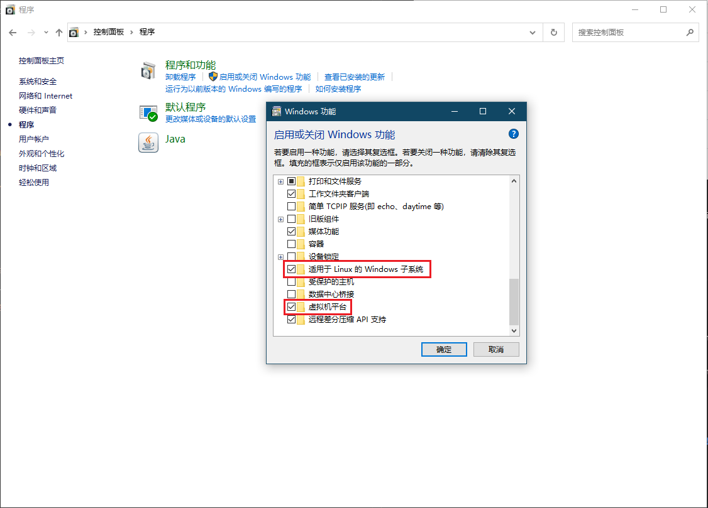

# WSL2

1. WSL 2 是适用于 Linux 的 Windows 子系统体系结构的一个新版本，它支持适用于 Linux 的 Windows 子系统在 Windows 上运行 ELF64 Linux 二进制文件。 它的主要目标是提高文件系统性能，以及添加完全的系统调用兼容性。
2. Flink推荐WSL作为源码编译环境。

## WSL2安装

### 启用 Windows-Subsystem-Linux

1. 在 `控制面板`-`程序`- `启用或关闭 Windows 功能` 中勾选 `适用于 Linux 的 Windows 子系统` 以及 `虚拟机平台`(wsl2 需要)

或者命令行安装：

~~~
# 适用于 Linux 的 Windows 子系统
dism.exe /online /enable-feature /featurename:Microsoft-Windows-Subsystem-Linux /all /norestart

# 虚拟机平台
dism.exe /online /enable-feature /featurename:VirtualMachinePlatform /all /norestart
~~~

完成后，重启电脑。

### 安装WSL2

1. 查询在线安装列表

   ~~~
   wsl --list --online 
   wsl -l -o
   ~~~

2. 根据在线安装列表安装Linux

   ~~~
   wsl --install -d <Distribution Name>
   ~~~

   将 `<Distribution Name>` 替换为要安装的发行版的名称。

### 修改WSL2的安装位置

1. 关闭WSL

   ~~~
   wsl --shutdown
   ~~~

2. 查看系统信息

   ~~~
   wsl -l -v
   ~~~

3. 导出系统，示例如下

   ~~~
   wsl --export Ubuntu-20.04  D:\ubuntu.tar
   ~~~

4. 删除系统，示例如下：

   ~~~
   wsl --unregister Ubuntu-20.04
   ~~~

5. 导入系统，指定新的位置 ，示例如下：

   ~~~
   wsl --import Ubuntu-20.04 D:\Ubuntu-20.04 D:\ubuntu.tar
   ~~~

6. ubuntu.tar文件不需要的话可以删掉了

### wsl 命令

- `wsl --shutdown` 立即终止所有正在运行的发行版和 WSL 2 轻型工具虚拟机
- `wsl -t <发行版>` 终止指定的发行版
- `wsl -l` 列出发行版
- `wsl -l -v` 列出发行版及其版本信息
- `wsl -l -o ` 列出在线版本
- `wsl -s <发行版>` 将发行版设为默认
- `wsl --export <发行版> <文件名>` 将发行版导出到 tar 文件
- `wsl --import <发行版> <安装位置> <文件名> [选项]` 将指定的 tar 文件作为新发行版进行导入
- `wsl -d <Name>` 命令行进入Ubunto 环境

## 虚拟机网络环境修改

因为WSL2 基于 Hyper-V 运行，导致 Linux 子系统和 Windows 在网络上是两台各自独立的机器，从 Linux 子系统访问 Windows 首先需要找到 Windows 的 IP。

### 获取 Windows ip 地址

~~~
wsl -d ubuntu #进入ubuntu
ip route #获取网关ip地址
~~~

### 修改 ~/.profile

~~~
export http_proxy=http://172.21.240.1:7890
export https_proxy=http://172.21.240.1:7890
export all_proxy=socks5://172.21.240.1:7891

#重启环境
source ~/.profile
~~~

## 安装maven包

WSL2 可以访问 Windows 环境。Windows 盘挂在 /mnt 上。只需要将 Windows路径的 maven 安装包 cp 即可。

## 安装git

~~~
sudo apt update
sudo apt install git -y
~~~

###  clone Flink 源码

~~~
git clone git@github.com:apache/flink.git
~~~

### 切换 1.15 分支

因为公司使用版本是 1.15，所以用 Flink 1.15 版本演示。

~~~
git branch -r
git checkout -b release-1.15 origin/release-1.15
git branch
~~~

## 安装 Java8

~~~
sudo apt update
sudo apt install openjdk-8-jdk -y
~~~

## vscode remote 开发

1. 下载 vscode
2. 按F1
3. WSL 远程连接 即可

## idea开发

1. 下载 idea
2. 利用idea gateway 进行开发连接
