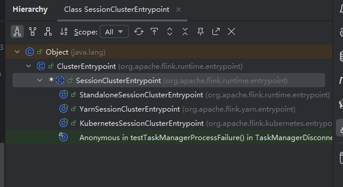

# JobManager 初始化流程

## 1. 找到入口类 `StandaloneSessionClusterEntrypoint`

该类位于 Flink 源码的以下路径中：
```
flink-runtime/src/main/java/org/apache/flink/runtime/entrypoint/StandaloneSessionClusterEntrypoint.java
```

## 2. 查看 `main` 方法

```java
/** Entry point for the standalone session cluster. */
public class StandaloneSessionClusterEntrypoint extends SessionClusterEntrypoint {

    public StandaloneSessionClusterEntrypoint(Configuration configuration) {
        super(configuration);
    }

    // 创建 Dispatcher + ResourceManager + JobManager 的组合组件工厂。
    @Override
    protected DefaultDispatcherResourceManagerComponentFactory
            createDispatcherResourceManagerComponentFactory(Configuration configuration) {
        return DefaultDispatcherResourceManagerComponentFactory.createSessionComponentFactory(
                StandaloneResourceManagerFactory.getInstance());
    }

    public static void main(String[] args) {
        // startup checks and logging
        EnvironmentInformation.logEnvironmentInfo(
                LOG, StandaloneSessionClusterEntrypoint.class.getSimpleName(), args);
        SignalHandler.register(LOG); // 注册 UNIX 信号处理器（如 SIGTERM）
        JvmShutdownSafeguard.installAsShutdownHook(LOG); // JVM 关闭钩子，确保资源优雅释放

        // 加载 JobManager 配置
        final EntrypointClusterConfiguration entrypointClusterConfiguration =
                ClusterEntrypointUtils.parseParametersOrExit(
                        args,
                        new EntrypointClusterConfigurationParserFactory(),
                        StandaloneSessionClusterEntrypoint.class);
        Configuration configuration = loadConfiguration(entrypointClusterConfiguration);

        // 根据配置加载启动类并启动集群
        StandaloneSessionClusterEntrypoint entrypoint =
                new StandaloneSessionClusterEntrypoint(configuration);

        ClusterEntrypoint.runClusterEntrypoint(entrypoint);
    }
}
```

## 3. UML 结构图

查看 `StandaloneSessionClusterEntrypoint` 类的 UML 图结构有助于理解其继承关系和依赖组件。



## 4. `ClusterEntrypoint` 核心成员与方法

`ClusterEntrypoint` 是整个集群启动的核心类，它封装了大多数组件和服务的初始化逻辑。关键成员包括：

- `resourceId`: 资源 ID
- `clusterComponent`: 包含 Dispatcher、ResourceManager 等核心组件
- `metricRegistry`: 指标注册表
- `haServices`: 高可用服务
- `blobServer`: BLOB 存储服务
- `heartbeatServices`: 心跳服务
- `commonRpcService`: 公共 RPC 服务
- `workingDirectory`: 工作目录
- `shutDownHook`: JVM 关闭钩子

### 主要方法

#### `runCluster(...)`

用于启动集群服务并创建核心组件。

```java
private void runCluster(Configuration configuration, PluginManager pluginManager) throws Exception {
    synchronized (lock) {
        initializeServices(configuration, pluginManager);

        // 设置 JobManager 地址和端口
        configuration.setString(JobManagerOptions.ADDRESS, commonRpcService.getAddress());
        configuration.setInteger(JobManagerOptions.PORT, commonRpcService.getPort());

        // 创建 Dispatcher 和 ResourceManager 组件
        final DispatcherResourceManagerComponentFactory dispatcherResourceManagerComponentFactory =
                createDispatcherResourceManagerComponentFactory(configuration);

        clusterComponent =
                dispatcherResourceManagerComponentFactory.create(
                        configuration,
                        resourceId.unwrap(),
                        ioExecutor,
                        commonRpcService,
                        haServices,
                        blobServer,
                        heartbeatServices,
                        metricRegistry,
                        executionGraphInfoStore,
                        new RpcMetricQueryServiceRetriever(metricRegistry.getMetricQueryServiceRpcService()),
                        this);

        // 注册关闭回调
        clusterComponent.getShutDownFuture().whenComplete((ApplicationStatus applicationStatus, Throwable throwable) -> {
            if (throwable != null) {
                shutDownAsync(ApplicationStatus.UNKNOWN, ShutdownBehaviour.GRACEFUL_SHUTDOWN, ExceptionUtils.stringifyException(throwable), false);
            } else {
                shutDownAsync(applicationStatus, ShutdownBehaviour.GRACEFUL_SHUTDOWN, null, true);
            }
        });
    }
}
```

#### `initializeServices(...)`

负责初始化各种集群服务，包括：

- `RpcService`
- `BlobServer`
- `HeartbeatServices`
- `MetricRegistry`
- `ExecutionGraphInfoStore`

## 5. `SessionClusterEntrypoint` 源码分析

该类是 `ClusterEntrypoint` 的抽象子类，主要实现了执行图存储方式的创建逻辑。

```java
public abstract class SessionClusterEntrypoint extends ClusterEntrypoint {

    public SessionClusterEntrypoint(Configuration configuration) {
        super(configuration);
    }

    @Override
    protected ExecutionGraphInfoStore createSerializableExecutionGraphStore(
            Configuration configuration, ScheduledExecutor scheduledExecutor) throws IOException {
        final JobManagerOptions.JobStoreType jobStoreType =
                configuration.get(JobManagerOptions.JOB_STORE_TYPE);
        final Time expirationTime =
                Time.seconds(configuration.getLong(JobManagerOptions.JOB_STORE_EXPIRATION_TIME));
        final int maximumCapacity =
                configuration.getInteger(JobManagerOptions.JOB_STORE_MAX_CAPACITY);

        switch (jobStoreType) {
            case File:
                {
                    final File tmpDir =
                            new File(ConfigurationUtils.parseTempDirectories(configuration)[0]);
                    final long maximumCacheSizeBytes =
                            configuration.getLong(JobManagerOptions.JOB_STORE_CACHE_SIZE);

                    return new FileExecutionGraphInfoStore(
                            tmpDir,
                            expirationTime,
                            maximumCapacity,
                            maximumCacheSizeBytes,
                            scheduledExecutor,
                            Ticker.systemTicker());
                }
            case Memory:
                {
                    return new MemoryExecutionGraphInfoStore(
                            expirationTime,
                            maximumCapacity,
                            scheduledExecutor,
                            Ticker.systemTicker());
                }
            default:
                throw new IllegalArgumentException("Unsupported job store type " + jobStoreType);
        }
    }
}
```

## 6. `ClusterEntrypoint.runClusterEntrypoint(...)` 启动流程

```java
public static void runClusterEntrypoint(ClusterEntrypoint clusterEntrypoint) {
    final String clusterEntrypointName = clusterEntrypoint.getClass().getSimpleName();
    try {
        clusterEntrypoint.startCluster(); // 启动集群
    } catch (ClusterEntrypointException e) {
        LOG.error(String.format("Could not start cluster entrypoint %s.", clusterEntrypointName), e);
        System.exit(STARTUP_FAILURE_RETURN_CODE);
    }

    int returnCode;
    Throwable throwable = null;

    try {
        returnCode = clusterEntrypoint.getTerminationFuture().get().processExitCode();
    } catch (Throwable e) {
        throwable = ExceptionUtils.stripExecutionException(e);
        returnCode = RUNTIME_FAILURE_RETURN_CODE;
    }

    LOG.info(
            "Terminating cluster entrypoint process {} with exit code {}.",
            clusterEntrypointName,
            returnCode,
            throwable);
    System.exit(returnCode);
}
```

## 7. `startCluster()` 方法详解

这是集群启动的核心入口，负责安全上下文设置、插件管理器初始化、文件系统配置等。直接看  `runCluster(configuration, pluginManager);`方法

```java
public void startCluster() throws ClusterEntrypointException {
    LOG.info("Starting {}.", getClass().getSimpleName());

    try {
        FlinkSecurityManager.setFromConfiguration(configuration);
        PluginManager pluginManager = PluginUtils.createPluginManagerFromRootFolder(configuration);
        configureFileSystems(configuration, pluginManager);

        SecurityContext securityContext = installSecurityContext(configuration);
        ClusterEntrypointUtils.configureUncaughtExceptionHandler(configuration);

        securityContext.runSecured(
                (Callable<Void>) () -> {
                    runCluster(configuration, pluginManager);
                    return null;
                });
    } catch (Throwable t) {
        final Throwable strippedThrowable = ExceptionUtils.stripException(t, UndeclaredThrowableException.class);

        try {
            // 清理部分状态
            shutDownAsync(
                    ApplicationStatus.FAILED,
                    ShutdownBehaviour.GRACEFUL_SHUTDOWN,
                    ExceptionUtils.stringifyException(strippedThrowable),
                    false)
                .get(INITIALIZATION_SHUTDOWN_TIMEOUT.toMilliseconds(), TimeUnit.MILLISECONDS);
        } catch (InterruptedException | ExecutionException | TimeoutException e) {
            strippedThrowable.addSuppressed(e);
        }

        throw new ClusterEntrypointException(
                String.format("Failed to initialize the cluster entrypoint %s.", getClass().getSimpleName()),
                strippedThrowable);
    }
}
```

## 8.`runCluster`方法

首先初始化 各类 akka的services。然后创建对应的各类组件。首先看 `initializeServices(configuration, pluginManager);`

~~~java
private void runCluster(Configuration configuration, PluginManager pluginManager)
            throws Exception {
        synchronized (lock) {
            initializeServices(configuration, pluginManager);

            // write host information into configuration
            configuration.setString(JobManagerOptions.ADDRESS, commonRpcService.getAddress());
            configuration.setInteger(JobManagerOptions.PORT, commonRpcService.getPort());

            final DispatcherResourceManagerComponentFactory
                    dispatcherResourceManagerComponentFactory =
                            createDispatcherResourceManagerComponentFactory(configuration);

            clusterComponent =
                    dispatcherResourceManagerComponentFactory.create(
                            configuration,
                            resourceId.unwrap(),
                            ioExecutor,
                            commonRpcService,
                            haServices,
                            blobServer,
                            heartbeatServices,
                            metricRegistry,
                            executionGraphInfoStore,
                            new RpcMetricQueryServiceRetriever(
                                    metricRegistry.getMetricQueryServiceRpcService()),
                            this);

            clusterComponent
                    .getShutDownFuture()
                    .whenComplete(
                            (ApplicationStatus applicationStatus, Throwable throwable) -> {
                                if (throwable != null) {
                                    shutDownAsync(
                                            ApplicationStatus.UNKNOWN,
                                            ShutdownBehaviour.GRACEFUL_SHUTDOWN,
                                            ExceptionUtils.stringifyException(throwable),
                                            false);
                                } else {
                                    // This is the general shutdown path. If a separate more
                                    // specific shutdown was
                                    // already triggered, this will do nothing
                                    shutDownAsync(
                                            applicationStatus,
                                            ShutdownBehaviour.GRACEFUL_SHUTDOWN,
                                            null,
                                            true);
                                }
                            });
        }
    }
~~~

## 9.`initializeServices`方法

1. 关注加载rpcSystem
2. blob服务
3. 注册akka的metric系统

~~~java
protected void initializeServices(Configuration configuration, PluginManager pluginManager)
            throws Exception {

        LOG.info("Initializing cluster services.");

        synchronized (lock) {
            //获取集群id
            resourceId =
                    configuration
                            .getOptional(JobManagerOptions.JOB_MANAGER_RESOURCE_ID)
                            .map(
                                    value ->
                                            DeterminismEnvelope.deterministicValue(
                                                    new ResourceID(value)))
                            .orElseGet(
                                    () ->
                                            DeterminismEnvelope.nondeterministicValue(
                                                    ResourceID.generate()));

            LOG.debug(
                    "Initialize cluster entrypoint {} with resource id {}.",
                    getClass().getSimpleName(),
                    resourceId);

            //获取jobmananger的临时路径
            workingDirectory =
                    ClusterEntrypointUtils.createJobManagerWorkingDirectory(
                            configuration, resourceId);

            LOG.info("Using working directory: {}.", workingDirectory);

            //加载rpcSystem
            rpcSystem = RpcSystem.load(configuration);

            //开启akka
            commonRpcService =
                    RpcUtils.createRemoteRpcService(
                            rpcSystem,
                            configuration,
                            configuration.getString(JobManagerOptions.ADDRESS),
                            getRPCPortRange(configuration),
                            configuration.getString(JobManagerOptions.BIND_HOST),
                            configuration.getOptional(JobManagerOptions.RPC_BIND_PORT));

            //加载监控配置
            JMXService.startInstance(configuration.getString(JMXServerOptions.JMX_SERVER_PORT));

            // update the configuration used to create the high availability services
            configuration.setString(JobManagerOptions.ADDRESS, commonRpcService.getAddress());
            configuration.setInteger(JobManagerOptions.PORT, commonRpcService.getPort());

           	//线程池
            ioExecutor =
                    Executors.newFixedThreadPool(
                            ClusterEntrypointUtils.getPoolSize(configuration),
                            new ExecutorThreadFactory("cluster-io"));
            //高可用
            haServices = createHaServices(configuration, ioExecutor, rpcSystem);
            //blob服务
            blobServer =
                    BlobUtils.createBlobServer(
                            configuration,
                            Reference.borrowed(workingDirectory.unwrap().getBlobStorageDirectory()),
                            haServices.createBlobStore());
            blobServer.start();
            configuration.setString(BlobServerOptions.PORT, String.valueOf(blobServer.getPort()));
            heartbeatServices = createHeartbeatServices(configuration);
            //注册akka的metric系统
            metricRegistry = createMetricRegistry(configuration, pluginManager, rpcSystem);

            final RpcService metricQueryServiceRpcService =
                    MetricUtils.startRemoteMetricsRpcService(
                            configuration,
                            commonRpcService.getAddress(),
                            configuration.getString(JobManagerOptions.BIND_HOST),
                            rpcSystem);
            metricRegistry.startQueryService(metricQueryServiceRpcService, null);

            final String hostname = RpcUtils.getHostname(commonRpcService);

            processMetricGroup =
                    MetricUtils.instantiateProcessMetricGroup(
                            metricRegistry,
                            hostname,
                            ConfigurationUtils.getSystemResourceMetricsProbingInterval(
                                    configuration));
			
            //初始化图存储方法
            executionGraphInfoStore =
                    createSerializableExecutionGraphStore(
                            configuration, commonRpcService.getScheduledExecutor());
        }
    }
~~~

## 10.`RpcSystem` UML 继承结构总览

~~~
                 +---------------------+
                 |     RpcSystem       | <------------------+    接口
                 +---------------------+                    |
                 | +RpcServiceBuilder  | <--+               |
                 | +load(...)          |    |               |
                 | +remoteServiceBuilder(...)              |
                 | +ForkJoinExecutorConfiguration          |
                 | +FixedThreadPoolExecutorConfiguration   |
                 +---------------------+                   |
                        ^                                  |
                        | implements                       |
        +---------------+--------------------------+       |
        |                                          |       |
+----------------------+           +----------------------------+
|     AkkaRpcSystem     |           |  CleanupOnCloseRpcSystem   |
+----------------------+           +----------------------------+
|  基于 Akka 的实现     |           |  装饰器/增强关闭功能       |
+----------------------+           +----------------------------+

RpcSystem 还 extends:
- RpcSystemUtils 接口（工具类接口）
- AutoCloseable（资源关闭接口）
~~~

## 11.RpcSystem接口组成分析

### 1. `RpcSystem` 接口定义了整个 RPC 系统的能力核心：

- `RpcSystemUtils`: 提供一些网络地址处理、消息大小限制等工具方法

  - `getRpcUrl(...)`: 构造 rpc 地址字符串
  - `getInetSocketAddressFromRpcUrl(...)`: 从 URL 解析 socket 地址
  - `getMaximumMessageSizeInBytes(...)`: 获取最大消息大小

- `AutoCloseable`：用于生命周期管理，定义了 `close()` 方法

- 内部接口 `RpcServiceBuilder`：核心功能，用于构建 RPC 服务：

  ~~~java
  interface RpcServiceBuilder {
      RpcServiceBuilder withConfiguration(Configuration config);
      RpcServiceBuilder withActorSystem(Resource);
      RpcService createAndStart();
  }
  ~~~

- 一些用于构建线程池的配置类（`ForkJoinExecutorConfiguration` / `FixedThreadPoolExecutorConfiguration`）

  `remoteServiceBuilder(...)` 与 `load(...)` 方法：

  - `remoteServiceBuilder`: 返回用于构建远程 RPC 服务的 builder
  - `load(...)`: 加载配置中指定的 RpcSystem（通常通过 SPI 实现）

### 2. 两个主要实现类

#### `AkkaRpcSystem`

- 真正的 RPC 实现，Flink 默认使用的 RPC 通信机制基于 **Akka**
- 实现了 `RpcSystem`
- 使用 `AkkaRpcServiceUtils` 作为工具类加载配置、构建 ActorSystem
- 创建 `AkkaRpcService` 作为具体服务实例，管理 Dispatcher、TaskExecutor 等

####  `CleanupOnCloseRpcSystem`

- 典型的**装饰器模式**，用于在关闭 `RpcSystem` 时增强清理行为
- 持有一个 `delegate: RpcSystem` 成员
- 在调用 `close()` 时执行额外的资源清理

## 12.调用关系简要说明

~~~
ClusterEntrypoint.runClusterEntrypoint()
    └── RpcSystem.load(...)       ← SPI 加载 AkkaRpcSystem
          └── AkkaRpcSystem.remoteServiceBuilder(...)
                └── AkkaRpcServiceUtils 负责构建 Akka ActorSystem
~~~

## 13.常见类关系/调用路径

1. 配置加载 `RpcSystem.load(...)`（从 SPI 中读取类名，默认是 Akka）

2. 构建 `RpcServiceBuilder` → `AkkaRpcServiceBuilder`

3. 最终构造 `RpcService`（用于 Dispatcher、ResourceManager、TaskExecutor 通信）

## 14.`RpcSystem`的`load`方法

1. 查找 RpcSystemLoader 实现类

~~~java
static RpcSystem load(Configuration config) {
        final Iterator<RpcSystemLoader> iterator =
            	//加载实现了 RpcSystemLoader 的方法
                ServiceLoader.load(RpcSystemLoader.class).iterator();

        Exception loadError = null;
        while (iterator.hasNext()) {
            //返回第一个实现了 RpcSystemLoader 的方法类
            final RpcSystemLoader next = iterator.next();
            try {
			    //返回第一个实现了 RpcSystemLoader 的方法类
                return next.loadRpcSystem(config);
            } catch (Exception e) {
                loadError = ExceptionUtils.firstOrSuppressed(e, loadError);
            }
        }
        throw new RpcLoaderException("Could not load RpcSystem.", loadError);
    }
~~~

2. 实现RpcSystemLoader方法的只有 `AkkaRpcSystemLoader`。

~~~java
public class AkkaRpcSystemLoader implements RpcSystemLoader {

    /** The name of the akka dependency jar, bundled with flink-rpc-akka-loader module artifact. */
    private static final String FLINK_RPC_AKKA_FAT_JAR = "flink-rpc-akka.jar";

    static final String HINT_USAGE =
            "mvn clean package -pl flink-rpc/flink-rpc-akka,flink-rpc/flink-rpc-akka-loader -DskipTests";

    @Override
    public RpcSystem loadRpcSystem(Configuration config) {
        try {
            //获取RpcSystem的类加载器
            final ClassLoader flinkClassLoader = RpcSystem.class.getClassLoader();

            //将包里的 flink-rpc-akka_解压到临时目录
            final Path tmpDirectory = Paths.get(ConfigurationUtils.parseTempDirectories(config)[0]);
            Files.createDirectories(tmpDirectory);
            final Path tempFile =
                    Files.createFile(
                            tmpDirectory.resolve("flink-rpc-akka_" + UUID.randomUUID() + ".jar"));
            final InputStream resourceStream =
                    flinkClassLoader.getResourceAsStream(FLINK_RPC_AKKA_FAT_JAR);
            if (resourceStream == null) {
                throw new RpcLoaderException(
                        String.format(
                                "Akka RPC system could not be found. If this happened while running a test in the IDE, "
                                        + "run '%s' on the command-line, "
                                        + "or add a test dependency on the flink-rpc-akka-loader test-jar.",
                                HINT_USAGE));
            }

            IOUtils.copyBytes(resourceStream, Files.newOutputStream(tempFile));
			
            //这里用了自定义类加载器加载flink的akkaRpcSystem。不做解析，自己去看下，源码非常简单。
            final SubmoduleClassLoader submoduleClassLoader =
                    new SubmoduleClassLoader(
                            new URL[] {tempFile.toUri().toURL()}, flinkClassLoader);

            return new CleanupOnCloseRpcSystem(
                    ServiceLoader.load(RpcSystem.class, submoduleClassLoader).iterator().next(),
                    submoduleClassLoader,
                    tempFile);
        } catch (IOException e) {
            throw new RuntimeException("Could not initialize RPC system.", e);
        }
    }
}
~~~

## 15.`RpcUtils.createRemoteRpcService`方法。

- 该方法接收6个参数。

~~~
public static RpcService createRemoteRpcService(
            RpcSystem rpcSystem,
            Configuration configuration,
            @Nullable String externalAddress,
            String externalPortRange,
            @Nullable String bindAddress,
            @SuppressWarnings("OptionalUsedAsFieldOrParameterType") Optional<Integer> bindPort)
            throws Exception {
        RpcSystem.RpcServiceBuilder rpcServiceBuilder =
        		//这里直接看 akkaRpcSystem.remoteServiceBuilder。返回一个 AkkaRpcServiceBuilder
                rpcSystem.remoteServiceBuilder(configuration, externalAddress, externalPortRange);
        if (bindAddress != null) {
            rpcServiceBuilder = rpcServiceBuilder.withBindAddress(bindAddress);
        }
        if (bindPort.isPresent()) {
            rpcServiceBuilder = rpcServiceBuilder.withBindPort(bindPort.get());
        }
        return rpcServiceBuilder.createAndStart();
    }
~~~

## 16.`AkkaRpcServiceBuilder`构造方法。

获取对应的服务端对外地址和端口号范围。有了这两个，就可以弄一个rpc服务端。

~~~java
private AkkaRpcServiceBuilder(
                final Configuration configuration,
                final Logger logger,
                @Nullable final String externalAddress,
                final String externalPortRange) {
            this.configuration = Preconditions.checkNotNull(configuration);
            this.logger = Preconditions.checkNotNull(logger);
            this.externalAddress =
                    externalAddress == null
                            ? InetAddress.getLoopbackAddress().getHostAddress()
                            : externalAddress;
            this.externalPortRange = Preconditions.checkNotNull(externalPortRange);
        }
~~~

## 17.`rpcServiceBuilder.createAndStart();`方法

~~~java
 public AkkaRpcService createAndStart() throws Exception {
     		//第一次看到，可能有些奇怪。就是传进去一个 AkkaRpcService 的构造函数。接收3个方法
     		//所以，先看 createAndStart（TriFunction constructor）方法
            return createAndStart(AkkaRpcService::new);
        }

        public AkkaRpcService createAndStart(
                TriFunction<ActorSystem, AkkaRpcServiceConfiguration, ClassLoader, AkkaRpcService>
                        constructor)
                throws Exception {
            if (actorSystemExecutorConfiguration == null) {
                actorSystemExecutorConfiguration =
                        AkkaUtils.getForkJoinExecutorConfig(
                                AkkaBootstrapTools.getForkJoinExecutorConfiguration(configuration));
            }

            final ActorSystem actorSystem;

            // akka internally caches the context class loader
            // make sure it uses the plugin class loader
            try (TemporaryClassLoaderContext ignored =
                    TemporaryClassLoaderContext.of(getClass().getClassLoader())) {
                if (externalAddress == null) {
                    // create local actor system
                    actorSystem =
                            AkkaBootstrapTools.startLocalActorSystem(
                                    configuration,
                                    actorSystemName,
                                    logger,
                                    actorSystemExecutorConfiguration,
                                    customConfig);
                } else {
                    //这一步最关键，获取的是 akka 的容器。这里flink扩展了akka的容器功能。对应的类是 RobustActorSystem。
                    // create remote actor system
                    actorSystem =
                            AkkaBootstrapTools.startRemoteActorSystem(
                                    configuration,
                                    actorSystemName,
                                    externalAddress,
                                    externalPortRange,
                                    bindAddress,
                                    Optional.ofNullable(bindPort),
                                    logger,
                                    actorSystemExecutorConfiguration,
                                    customConfig);
                }
            }
			//这一步是将 akka 的 容器和akka的actor绑定。
            return constructor.apply(
                    actorSystem,
                    AkkaRpcServiceConfiguration.fromConfiguration(configuration),
                    RpcService.class.getClassLoader());
        }
~~~

## 18.`AkkaRpcService`构造方法

~~~java
AkkaRpcService(
            final ActorSystem actorSystem,
            final AkkaRpcServiceConfiguration configuration,
            final ClassLoader flinkClassLoader) {
        this.actorSystem = checkNotNull(actorSystem, "actor system");
        this.configuration = checkNotNull(configuration, "akka rpc service configuration");
        this.flinkClassLoader = checkNotNull(flinkClassLoader, "flinkClassLoader");

        Address actorSystemAddress = AkkaUtils.getAddress(actorSystem);

        if (actorSystemAddress.host().isDefined()) {
            address = actorSystemAddress.host().get();
        } else {
            address = "";
        }

        if (actorSystemAddress.port().isDefined()) {
            port = (Integer) actorSystemAddress.port().get();
        } else {
            port = -1;
        }

        captureAskCallstacks = configuration.captureAskCallStack();

        // Akka always sets the threads context class loader to the class loader with which it was
        // loaded (i.e., the plugin class loader)
        // we must ensure that the context class loader is set to the Flink class loader when we
        // call into Flink
        // otherwise we could leak the plugin class loader or poison the context class loader of
        // external threads (because they inherit the current threads context class loader)
        internalScheduledExecutor =
                new ActorSystemScheduledExecutorAdapter(actorSystem, flinkClassLoader);

        terminationFuture = new CompletableFuture<>();

        stopped = false;
		
    	//这一步是关键，绑定对应的Actor。看对应的 startSupervisorActor
        supervisor = startSupervisorActor();
        startDeadLettersActor();
    }


private Supervisor startSupervisorActor() {
        final ExecutorService terminationFutureExecutor =
                Executors.newSingleThreadExecutor(
                        new ExecutorThreadFactory(
                                "AkkaRpcService-Supervisor-Termination-Future-Executor"));
        final ActorRef actorRef =
            	//这一步是关键，将对应的线程池和actorSystem绑定在一起
                SupervisorActor.startSupervisorActor(
                        actorSystem,
                        withContextClassLoader(terminationFutureExecutor, flinkClassLoader));

        return Supervisor.create(actorRef, terminationFutureExecutor);
    }

 public static ActorRef startSupervisorActor(
            ActorSystem actorSystem, Executor terminationFutureExecutor) {
        final Props supervisorProps =
            	//将 SupervisorActor初始化，并绑定在 actorSystem。因此，直接看 SupervisorActor 和对应的构造函数
                Props.create(SupervisorActor.class, terminationFutureExecutor)
                        .withDispatcher("akka.actor.supervisor-dispatcher");
        return actorSystem.actorOf(supervisorProps, getActorName());
    }

//构造函数
SupervisorActor(Executor terminationFutureExecutor) {
        this.terminationFutureExecutor = terminationFutureExecutor;
        this.registeredAkkaRpcActors = new HashMap<>();
    }


@Override
    public Receive createReceive() {
        return receiveBuilder()
            	//该方法接收一个 StartAkkaRpcActor message。并调用 createStartAkkaRpcActorMessage 方法
            	//所以，首先看 StartAkkaRpcActor 对象。然后看 createStartAkkaRpcActorMessage 方法
                .match(StartAkkaRpcActor.class, this::createStartAkkaRpcActorMessage)
                .matchAny(this::handleUnknownMessage)
                .build();
    }
~~~

## 19.StartAkkaRpcActor 对象

~~~java
 // -----------------------------------------------------------------------------
    // Messages
    // -----------------------------------------------------------------------------
	//注释直接表明该类是消息，包含两个成员。第一个是props的工厂类。返回的是 actor的prop。
    //第二个是 endpointId。用来表明该消息的路径
    static final class StartAkkaRpcActor {
        private final PropsFactory propsFactory;
        private final String endpointId;

        private StartAkkaRpcActor(PropsFactory propsFactory, String endpointId) {
            this.propsFactory = propsFactory;
            this.endpointId = endpointId;
        }

        public String getEndpointId() {
            return endpointId;
        }

        public PropsFactory getPropsFactory() {
            return propsFactory;
        }

        private static StartAkkaRpcActor create(PropsFactory propsFactory, String endpointId) {
            return new StartAkkaRpcActor(propsFactory, endpointId);
        }

        interface PropsFactory {
            Props create(CompletableFuture<Void> terminationFuture);
        }
    }
~~~

## 20.`createStartAkkaRpcActorMessage`方法

~~~java
private void createStartAkkaRpcActorMessage(StartAkkaRpcActor startAkkaRpcActor) {
        final String endpointId = startAkkaRpcActor.getEndpointId();
        final AkkaRpcActorRegistration akkaRpcActorRegistration =
                new AkkaRpcActorRegistration(endpointId);
		//创建对应的props
        final Props akkaRpcActorProps =
                startAkkaRpcActor
                        .getPropsFactory()
                        .create(akkaRpcActorRegistration.getInternalTerminationFuture());

        LOG.debug(
                "Starting {} with name {}.",
                akkaRpcActorProps.actorClass().getSimpleName(),
                endpointId);

        try {
            //getContext() 方法返回的是actorsystem。这里可以看到将信息和路径绑定在一起。
            final ActorRef actorRef = getContext().actorOf(akkaRpcActorProps, endpointId);

            registeredAkkaRpcActors.put(actorRef, akkaRpcActorRegistration);

            getSender()
                    .tell(
                            StartAkkaRpcActorResponse.success(
                                    ActorRegistration.create(
                                            actorRef,
                                            akkaRpcActorRegistration
                                                    .getExternalTerminationFuture())),
                            getSelf());
        } catch (AkkaException akkaException) {
            getSender().tell(StartAkkaRpcActorResponse.failure(akkaException), getSelf());
        }
    }
~~~

## 21.`StartAkkaRpcActor `作用

- `StartAkkaRpcActor` 是 **一个辅助工具类**，用于将用户定义的 `RpcEndpoint` 包装为 Akka 的 Actor，并注册到 ActorSystem 中。
- 因此，只要在后面源码中，找到对应如何构建 `StartAkkaRpcActor`就能知道`flink`的如何同步信息的。

## 22.后面大部分源码都相同，因此感觉兴趣的自己去看下。

1. `blobServer`。他是一个简单的`socket`轮询线程。
2. `MetricUtils.startRemoteMetricsRpcService`构造了一个 `akka`的 `flink-metric`服务器。
3. `metricRegistry.startQueryService`则是akka的 Actor 注册逻辑，因此需要深入刨析。
4. `dispatcherResourceManagerComponentFactory.create(...)` 后续的流程，本质上是**用一套相同的 Akka RPC 构建机制**，依次注册 Flink 的核心组件 Actor，例如：
   - `ResourceManager`
   - `Dispatcher`
   - `JobManagerMetricGroup`
   - `WebMonitorEndpoint`（WebUI 后台）
   - 不多做讲解

## 23.`metricRegistry.startQueryService`源码

~~~java
public void startQueryService(RpcService rpcService, ResourceID resourceID) {
        synchronized (lock) {
            Preconditions.checkState(
                    !isShutdown(), "The metric registry has already been shut down.");

            try {
                metricQueryServiceRpcService = rpcService;
                queryService =
                    	//创建 MetricQueryService
                        MetricQueryService.createMetricQueryService(
                                rpcService, resourceID, maximumFramesize);
                queryService.start();
            } catch (Exception e) {
                LOG.warn(
                        "Could not start MetricDumpActor. No metrics will be submitted to the WebInterface.",
                        e);
            }
        }
    }


public static MetricQueryService createMetricQueryService(
            RpcService rpcService, ResourceID resourceID, long maximumFrameSize) {

        String endpointId =
                resourceID == null
                        ? METRIC_QUERY_SERVICE_NAME
                        : METRIC_QUERY_SERVICE_NAME + "_" + resourceID.getResourceIdString();
		//初始化 MetricQueryService
        return new MetricQueryService(rpcService, endpointId, maximumFrameSize);
    }


public MetricQueryService(RpcService rpcService, String endpointId, long messageSizeLimit) {
    	//这里往上看
        super(rpcService, endpointId);
        this.messageSizeLimit = messageSizeLimit;
    }

 protected RpcEndpoint(final RpcService rpcService, final String endpointId) {
        this.rpcService = checkNotNull(rpcService, "rpcService");
        this.endpointId = checkNotNull(endpointId, "endpointId");
		//这一步关键。这里是this，说明把自己作为 startServer的rpcEndpoint参数
        this.rpcServer = rpcService.startServer(this);

        this.mainThreadExecutor = new MainThreadExecutor(rpcServer, this::validateRunsInMainThread);
    }
~~~

24.查看 `AkkaRpcService.startServer` 和`registerAkkaRpcActor`方法

~~~java
 @Override
    public <C extends RpcEndpoint & RpcGateway> RpcServer startServer(C rpcEndpoint) {
        checkNotNull(rpcEndpoint, "rpc endpoint");

        final SupervisorActor.ActorRegistration actorRegistration =
            	//这个 rpcEndpoint 是 MetricQueryService
                registerAkkaRpcActor(rpcEndpoint);
        final ActorRef actorRef = actorRegistration.getActorRef();
        final CompletableFuture<Void> actorTerminationFuture =
                actorRegistration.getTerminationFuture();

        LOG.info(
                "Starting RPC endpoint for {} at {} .",
                rpcEndpoint.getClass().getName(),
                actorRef.path());

        final String akkaAddress = AkkaUtils.getAkkaURL(actorSystem, actorRef);
        final String hostname;
        Option<String> host = actorRef.path().address().host();
        if (host.isEmpty()) {
            hostname = "localhost";
        } else {
            hostname = host.get();
        }

        Set<Class<?>> implementedRpcGateways =
                new HashSet<>(RpcUtils.extractImplementedRpcGateways(rpcEndpoint.getClass()));

        implementedRpcGateways.add(RpcServer.class);
        implementedRpcGateways.add(AkkaBasedEndpoint.class);

        final InvocationHandler akkaInvocationHandler;

        if (rpcEndpoint instanceof FencedRpcEndpoint) {
            // a FencedRpcEndpoint needs a FencedAkkaInvocationHandler
            akkaInvocationHandler =
                    new FencedAkkaInvocationHandler<>(
                            akkaAddress,
                            hostname,
                            actorRef,
                            configuration.getTimeout(),
                            configuration.getMaximumFramesize(),
                            actorTerminationFuture,
                            ((FencedRpcEndpoint<?>) rpcEndpoint)::getFencingToken,
                            captureAskCallstacks,
                            flinkClassLoader);

            implementedRpcGateways.add(FencedMainThreadExecutable.class);
        } else {
            akkaInvocationHandler =
                    new AkkaInvocationHandler(
                            akkaAddress,
                            hostname,
                            actorRef,
                            configuration.getTimeout(),
                            configuration.getMaximumFramesize(),
                            actorTerminationFuture,
                            captureAskCallstacks,
                            flinkClassLoader);
        }

        // Rather than using the System ClassLoader directly, we derive the ClassLoader
        // from this class . That works better in cases where Flink runs embedded and all Flink
        // code is loaded dynamically (for example from an OSGI bundle) through a custom ClassLoader
        ClassLoader classLoader = getClass().getClassLoader();

        @SuppressWarnings("unchecked")
        RpcServer server =
                (RpcServer)
                        Proxy.newProxyInstance(
                                classLoader,
                                implementedRpcGateways.toArray(
                                        new Class<?>[implementedRpcGateways.size()]),
                                akkaInvocationHandler);

        return server;
    }

    private <C extends RpcEndpoint & RpcGateway>
            SupervisorActor.ActorRegistration registerAkkaRpcActor(C rpcEndpoint) {
        final Class<? extends AbstractActor> akkaRpcActorType;
		//这里做判断。不影响 startAkkaRpcActor 方法调用
        if (rpcEndpoint instanceof FencedRpcEndpoint) {
            akkaRpcActorType = FencedAkkaRpcActor.class;
        } else {
            //初始化了一个 AkkaRpcActor。所有的akka的消息在这里做了抽象。通过这个类的rpcEndpoint。反射调用
            akkaRpcActorType = AkkaRpcActor.class;
        }

        synchronized (lock) {
            checkState(!stopped, "RpcService is stopped");

            final SupervisorActor.StartAkkaRpcActorResponse startAkkaRpcActorResponse =
                	//这一步初始化信息
                    SupervisorActor.startAkkaRpcActor(
                            supervisor.getActor(),
                            actorTerminationFuture ->
                					//这里将 akka和对应的构造函数绑定。
                                    Props.create(
                                            akkaRpcActorType,
                                            rpcEndpoint,
                                            actorTerminationFuture,
                                            getVersion(),
                                            configuration.getMaximumFramesize(),
                                            flinkClassLoader),
                            rpcEndpoint.getEndpointId());

            final SupervisorActor.ActorRegistration actorRegistration =
                    startAkkaRpcActorResponse.orElseThrow(
                            cause ->
                                    new AkkaRpcRuntimeException(
                                            String.format(
                                                    "Could not create the %s for %s.",
                                                    AkkaRpcActor.class.getSimpleName(),
                                                    rpcEndpoint.getEndpointId()),
                                            cause));

            actors.put(actorRegistration.getActorRef(), rpcEndpoint);

            return actorRegistration;
        }
    }
~~~

## 24查看 AkkaRpcActor 和 MetricQueryService 源码

~~~java
@Override
    public Receive createReceive() {
        return ReceiveBuilder.create()
                .match(RemoteHandshakeMessage.class, this::handleHandshakeMessage)
                .match(ControlMessages.class, this::handleControlMessage)
                //查看该方法
                .matchAny(this::handleMessage)
                .build();
    }

private void handleMessage(final Object message) {
        if (state.isRunning()) {
            mainThreadValidator.enterMainThread();

            try {
                //处理信息
                handleRpcMessage(message);
            } finally {
                mainThreadValidator.exitMainThread();
            }
        } else {
            log.info(
                    "The rpc endpoint {} has not been started yet. Discarding message {} until processing is started.",
                    rpcEndpoint.getClass().getName(),
                    message);

            sendErrorIfSender(
                    new AkkaRpcException(
                            String.format(
                                    "Discard message %s, because the rpc endpoint %s has not been started yet.",
                                    message, rpcEndpoint.getAddress())));
        }
    }


protected void handleRpcMessage(Object message) {
        if (message instanceof RunAsync) {
            handleRunAsync((RunAsync) message);
        } else if (message instanceof CallAsync) {
            handleCallAsync((CallAsync) message);
        } else if (message instanceof RpcInvocation) {
            //远程反射调用
            handleRpcInvocation((RpcInvocation) message);
        } else {
            log.warn(
                    "Received message of unknown type {} with value {}. Dropping this message!",
                    message.getClass().getName(),
                    message);

            sendErrorIfSender(
                    new AkkaUnknownMessageException(
                            "Received unknown message "
                                    + message
                                    + " of type "
                                    + message.getClass().getSimpleName()
                                    + '.'));
        }
    }
~~~


## 25.总结

Flink 在 `RpcEndpoint` 和 `AkkaRpcActor` 层做了通信抽象，实现了组件之间的消息解耦与方法绑定。

### 总体设计理念：**组件内聚，通信解耦**

Flink 使用 Akka 构建了一个可寻址、可异步调用的 RPC 框架，目标是：

- **让组件之间通信像调用本地对象一样简单**
- **又能保证真正跨进程、跨网络、线程安全**

### 核心角色解构

| 类 / 接口           | 角色说明                                                     |
| ------------------- | ------------------------------------------------------------ |
| `RpcEndpoint`       | 组件逻辑的“服务端”，定义了可以暴露给远程调用的方法（如 Dispatcher、ResourceManager） |
| `AkkaRpcActor`      | Akka 中实际运行的 Actor，负责接收消息、找到目标 `RpcEndpoint` 并调用相应方法 |
| `RpcGateway`        | RPC 接口定义（接口层），供调用方使用，通常为异步 Future 方法 |
| `RpcService`        | 启动、管理 RPC 服务器和客户端连接，隐藏 Akka 的复杂性        |
| `StartAkkaRpcActor` | 帮你注册 `RpcEndpoint` 到 ActorSystem 中                     |