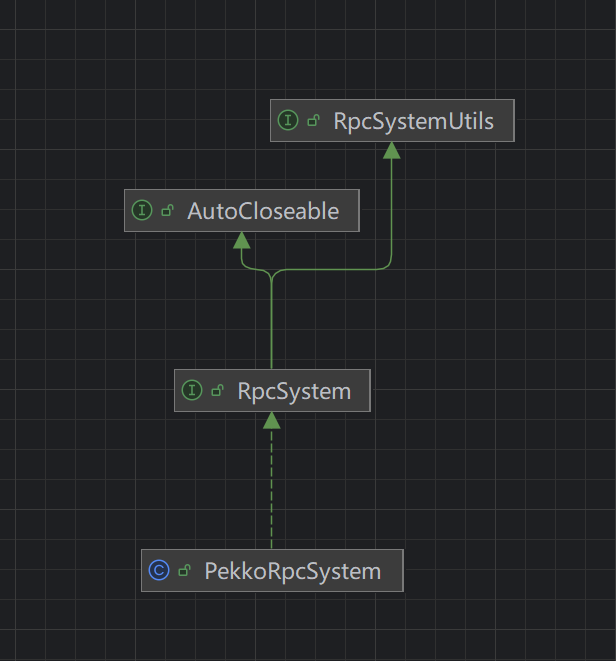
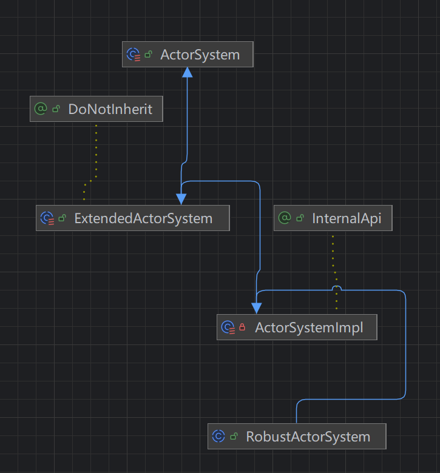
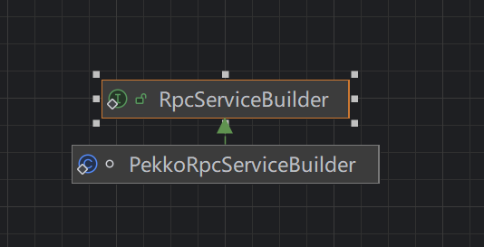

# PekkoAkka解析

- 在阅读 Flink 源码过程中，可以看到 Flink 在远程通信中重度依赖 Pekko（Akka 的一个社区分支）作为 RPC 框架。因此，有必要先解析相关类的实现逻辑，再结合调试分析启动过程。

## `ActorSystemBootstrapTools`

- `ActorSystemBootstrapTools`是一个封装类。除了构造函数，大部分主都是静态方法，主要用于创建 `ActorSystem` 实例。

- `ActorSystem` 是 Akka 的运行容器，通常由 Akka 框架创建。但在 Flink 中，为了增强未捕获异常的处理逻辑，使用了自定义类 `RobustActorSystem`。

  ~~~java
  /**
       * Starts a remote Actor System at given address and specific port.
       *
       * @param configuration The Flink configuration.
       * @param actorSystemName Name of the started {@link ActorSystem}
       * @param externalAddress The external address to access the ActorSystem.
       * @param externalPort The external port to access the ActorSystem.
       * @param bindAddress The local address to bind to.
       * @param bindPort The local port to bind to.
       * @param logger the logger to output log information.
       * @param actorSystemExecutorConfiguration configuration for the ActorSystem's underlying
       *     executor
       * @param customConfig Custom Pekko config to be combined with the config derived from Flink
       *     configuration.
       * @return The ActorSystem which has been started.
       * @throws Exception
       */
      private static ActorSystem startRemoteActorSystem(
              Configuration configuration,
              String actorSystemName,
              String externalAddress,
              int externalPort,
              String bindAddress,
              int bindPort,
              Logger logger,
              Config actorSystemExecutorConfiguration,
              Config customConfig)
              throws Exception {
  
          //获取对外暴露的端口和地址
          String externalHostPortUrl =
                  NetUtils.unresolvedHostAndPortToNormalizedString(externalAddress, externalPort);
          //获取绑定本机的端口和地址
          String bindHostPortUrl =
                  NetUtils.unresolvedHostAndPortToNormalizedString(bindAddress, bindPort);
          logger.info(
                  "Trying to start actor system, external address {}, bind address {}.",
                  externalHostPortUrl,
                  bindHostPortUrl);
  
          try {
              Config pekkoConfig =
                      PekkoUtils.getConfig(
                              configuration,
                              new HostAndPort(externalAddress, externalPort),
                              new HostAndPort(bindAddress, bindPort),
                              actorSystemExecutorConfiguration);
  
              if (customConfig != null) {
                  pekkoConfig = customConfig.withFallback(pekkoConfig);
              }
  			
              // 这一步返回 startActorSystem
              return startActorSystem(pekkoConfig, actorSystemName, logger);
          } catch (Throwable t) {
              if (t instanceof ChannelException) {
                  Throwable cause = t.getCause();
                  if (cause != null && t.getCause() instanceof BindException) {
                      throw new IOException(
                              "Unable to create ActorSystem at address "
                                      + bindHostPortUrl
                                      + " : "
                                      + cause.getMessage(),
                              t);
                  }
              }
              throw new Exception("Could not create actor system", t);
          }
      }
  
  
   /**
       * Starts an Actor System with given Pekko config.
       *
       * @param config Config of the started ActorSystem.
       * @param actorSystemName Name of the started ActorSystem.
       * @param logger The logger to output log information.
       * @return The ActorSystem which has been started.
       */
      private static ActorSystem startActorSystem(
              Config config, String actorSystemName, Logger logger) {
          logger.debug("Using pekko configuration\n {}", config);
          ActorSystem actorSystem = PekkoUtils.createActorSystem(actorSystemName, config);
  
          logger.info("Actor system started at {}", PekkoUtils.getAddress(actorSystem));
          return actorSystem;
      }
  ~~~

## `PekkoUtils`

 `PekkoUtils`是一个类，专门负责负责创建对应的 `ActorSystem`。`createActorSystem`方法，直接返回一个`RobustActorSystem`

~~~java
public static ActorSystem createActorSystem(String actorSystemName, Config config) {
        // Initialize slf4j as logger of Pekko's Netty instead of java.util.logging (FLINK-1650)
        InternalLoggerFactory.setDefaultFactory(new Slf4JLoggerFactory());
        return RobustActorSystem.create(actorSystemName, config);
}
~~~

## `RobustActorSystem`

`RobustActorSystem`继承了`ActorSystemImpl`。改写了`uncaughtExceptionHandler`方法。用来处理一些未处理的异常。

### `FatalExitExceptionHandler`

`FatalExitExceptionHandler`继承了 `Thread.UncaughtExceptionHandler`。是一个增强型接口。表明该类专门用来捕捉线程运行的未捕获异常。

源码可以看到，该列有一个单例对象。确保全局唯一。`uncaughtException`方法记录了当前异常信息，并将当前线程的堆栈信息输出到日志上，并强制退出程序。

~~~java
/**
 * Handler for uncaught exceptions that will log the exception and kill the process afterwards.
 *
 * 
This guarantees that critical exceptions are not accidentally lost and leave the system
 * running in an inconsistent state.
 */
public final class FatalExitExceptionHandler implements Thread.UncaughtExceptionHandler {

    private static final Logger LOG = LoggerFactory.getLogger(FatalExitExceptionHandler.class);

    public static final FatalExitExceptionHandler INSTANCE = new FatalExitExceptionHandler();
    public static final int EXIT_CODE = -17;

    @Override
    public void uncaughtException(Thread t, Throwable e) {
        try {
            LOG.error(
                    "FATAL: Thread '{}' produced an uncaught exception. Stopping the process...",
                    t.getName(),
                    e);
            ThreadUtils.errorLogThreadDump(LOG);
        } finally {
            FlinkSecurityManager.forceProcessExit(EXIT_CODE);
        }
    }
}
~~~

再来看一下 `RobustActorSystem`的构造方法。

~~~java
private static RobustActorSystem create(
            String name,
            ActorSystemSetup setup,
    		//uncaughtExceptionHandler 这个uncaughtExceptionHandler就是 FatalExitExceptionHandler 实例。
            Thread.UncaughtExceptionHandler uncaughtExceptionHandler) {
        final Optional<BootstrapSetup> bootstrapSettings = setup.get(BootstrapSetup.class);
        final ClassLoader classLoader = RobustActorSystem.class.getClassLoader();
        final Config appConfig =
                bootstrapSettings
                        .map(BootstrapSetup::config)
                        .flatMap(RobustActorSystem::toJavaOptional)
                        .orElseGet(() -> ConfigFactory.load(classLoader));
        final Option<ExecutionContext> defaultEC =
                toScalaOption(
                        bootstrapSettings
                                .map(BootstrapSetup::defaultExecutionContext)
                                .flatMap(RobustActorSystem::toJavaOptional));

    	//PostShutdownClassLoadingErrorFilter。增强接口，用来扩充uncaughtExceptionHandler方法。确保某些异常不会关闭程序。
        final PostShutdownClassLoadingErrorFilter postShutdownClassLoadingErrorFilter =
                new PostShutdownClassLoadingErrorFilter(uncaughtExceptionHandler);

        final RobustActorSystem robustActorSystem =
                new RobustActorSystem(name, appConfig, classLoader, defaultEC, setup) {
            		// RobustActorSystem 是一个抽象类，就是用来覆写uncaughtExceptionHandler 方法 
                    @Override
                    public Thread.UncaughtExceptionHandler uncaughtExceptionHandler() {
                        return postShutdownClassLoadingErrorFilter;
                    }
                };
    	//回调函数，该类终止时，表明该方法也终止
        robustActorSystem.registerOnTermination(
                postShutdownClassLoadingErrorFilter::notifyShutdownComplete);

    	//该容器类启动。可以挂载actor
        robustActorSystem.start();
        return robustActorSystem;
    }
~~~

## `PekkoRpcSystem`

`PekkoRpcSystem`继承了`RpcSystem`。`RpcSystem`继承了`RpcSystemUtils`。

除了提供构建 `RpcServiceBuilder` 的方法外，还提供了构建远程 URL、获取绑定地址、计算消息大小限制等辅助能力（定义在其父接口 `RpcSystemUtils` 中）。

### `RpcSystemUtils`

`RpcSystemUtils`是一个接口类。该类提供了3个方法。获取RpcURL和对应的地址端口号。还有一个消息发送的最大长度

~~~java
/** Utils that are dependent on the underlying RPC implementation. */
public interface RpcSystemUtils {

    /**
     * Constructs an RPC URL for the given parameters, that can be used to connect to the targeted
     * RpcService.
     *
     * @param hostname The hostname or address where the target RPC service is listening.
     * @param port The port where the target RPC service is listening.
     * @param endpointName The name of the RPC endpoint.
     * @param addressResolution Whether to try address resolution of the given hostname or not. This
     *     allows to fail fast in case that the hostname cannot be resolved.
     * @param config The configuration from which to deduce further settings.
     * @return The RPC URL of the specified RPC endpoint.
     */
    String getRpcUrl(
            String hostname,
            int port,
            String endpointName,
            AddressResolution addressResolution,
            Configuration config)
            throws UnknownHostException;

    /**
     * Returns an {@link InetSocketAddress} corresponding to the given RPC url.
     *
     * @see #getRpcUrl
     * @param url RPC url
     * @return inet socket address
     * @throws Exception if the URL is invalid
     */
    InetSocketAddress getInetSocketAddressFromRpcUrl(String url) throws Exception;

    /**
     * Returns the maximum number of bytes that an RPC message may carry according to the given
     * configuration. If no limit exists then {@link Long#MAX_VALUE} should be returned.
     *
     * @param config Flink configuration
     * @return maximum number of bytes that an RPC message may carry
     */
    long getMaximumMessageSizeInBytes(Configuration config);
}
~~~

### `RpcSystem`

`RpcSystem`主要返回`RpcServiceBuilder`构造类。该构造类专门用来负责构建 RpcServices的。

通过上面两个接口。可以看到 `PekkoRpcSystem`，主要负责构建 `RpcServiceBuilder` ，构建对应的URL地址，获取对应的地址和端口号等功能。

## `PekkoRpcServiceUtils`

- 包含一个静态构建器类 `PekkoRpcServiceBuilder`，用于构建 `PekkoRpcService`。

  其中 `createRemoteRpcService` 是典型用法，结合配置、外部绑定地址与端口构建并启动远程 RPC 服务。

~~~java
 static PekkoRpcService createRemoteRpcService(
            Configuration configuration,
            @Nullable String externalAddress,
            String externalPortRange,
            @Nullable String bindAddress,
            @SuppressWarnings("OptionalUsedAsFieldOrParameterType") Optional<Integer> bindPort)
            throws Exception {
        final PekkoRpcServiceBuilder rpcServiceBuilder =
                PekkoRpcServiceUtils.remoteServiceBuilder(
                        configuration, externalAddress, externalPortRange);

        if (bindAddress != null) {
            rpcServiceBuilder.withBindAddress(bindAddress);
        }

        bindPort.ifPresent(rpcServiceBuilder::withBindPort);

        return rpcServiceBuilder.createAndStart();
    }
~~~

## `PekkoRpcServiceBuilder`

继承于 `RpcServiceBuilder`。专门用来将`actor`挂在`ActorSystem`。并返回该 `Service`

典型方法 `createAndStart`

~~~java
   public PekkoRpcService createAndStart() throws Exception {
            return createAndStart(PekkoRpcService::new);
        }

public PekkoRpcService createAndStart(
                TriFunction<ActorSystem, PekkoRpcServiceConfiguration, ClassLoader, PekkoRpcService>
                        constructor)
                throws Exception {
            if (actorSystemExecutorConfiguration == null) {
                actorSystemExecutorConfiguration =
                        PekkoUtils.getForkJoinExecutorConfig(
                                ActorSystemBootstrapTools.getForkJoinExecutorConfiguration(
                                        configuration));
            }

            final ActorSystem actorSystem;

            // pekko internally caches the context class loader
            // make sure it uses the plugin class loader
            try (TemporaryClassLoaderContext ignored =
                    TemporaryClassLoaderContext.of(getClass().getClassLoader())) {
                if (externalAddress == null) {
                    // create local actor system
                    actorSystem =
                            ActorSystemBootstrapTools.startLocalActorSystem(
                                    configuration,
                                    actorSystemName,
                                    logger,
                                    actorSystemExecutorConfiguration,
                                    customConfig);
                } else {
                    // create remote actor system
                    actorSystem =
                            ActorSystemBootstrapTools.startRemoteActorSystem(
                                    configuration,
                                    actorSystemName,
                                    externalAddress,
                                    externalPortRange,
                                    bindAddress,
                                    Optional.ofNullable(bindPort),
                                    logger,
                                    actorSystemExecutorConfiguration,
                                    customConfig);
                }
            }

    		//该方法调用的 是 PekkoRpcService::new。需要三个参数。PekkoRpcService 这部分下个章节讲。
            return constructor.apply(
                    actorSystem,
                    PekkoRpcServiceConfiguration.fromConfiguration(configuration),
                    RpcService.class.getClassLoader());
        }
~~~

## 总结

1. 本章节共分析了 6 个与 `PekkoAkka` 相关的核心类，均为 Flink 在构建基于 Actor 模型的远程通信体系中使用的重要工具类。

2. `PekkoUtils` 调用了 `ActorSystemBootstrapTools` 作为引导类，用于创建 `ActorSystem` 实例。Flink 中的 `JobManager` 和 `TaskManager` 均基于 `RobustActorSystem` 构建，该类增强了未捕获异常的处理机制，确保系统在出现严重错误时能及时终止，避免数据一致性问题。

3. `PekkoRpcSystem` 是 Flink RPC 通信体系中的核心工厂类，负责生成 `RpcServiceBuilder`，并实现了包括 RPC URL 构造、地址端口解析、消息大小限制等依赖底层通信协议的细节方法。

4. `PekkoRpcServiceBuilder` 则是具体用于构建 `PekkoRpcService` 的工厂类，它综合使用了上述工具类，完成 ActorSystem 的构建、服务端口的绑定，并将远程 RPC Endpoint 注册到 ActorSystem 上，完成整个 RPC 服务的启动流程。

5. `PekkoRpcSystem`的UML图

   

   

6. `RobustActorSystem`UML图

   

7. `PekkoRpcServiceBuilder`UML图

   
