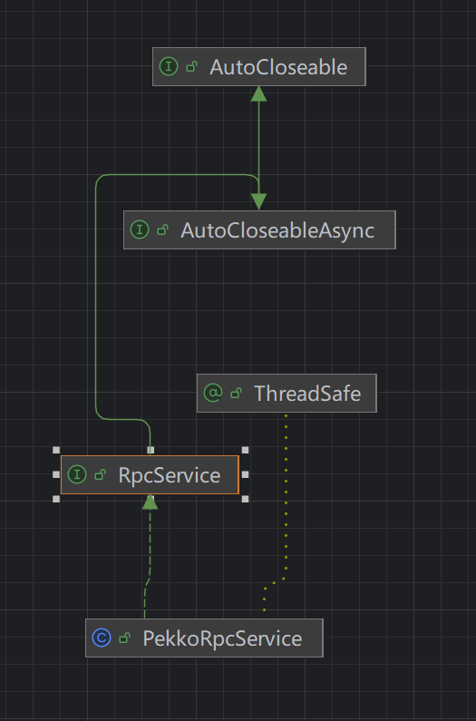
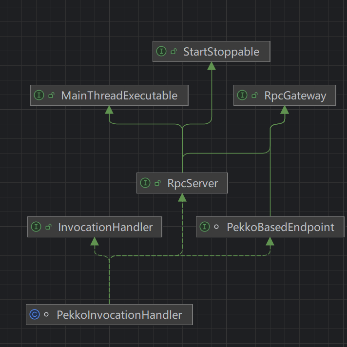

# PekkoAkka解析

- 在阅读 Flink 源码过程中，可以看到 Flink 在远程通信中重度依赖 Pekko（Akka 的一个社区分支）作为 RPC 框架。因此，有必要先解析相关类的实现逻辑，再结合调试分析启动过程。

## `PekkoRpcService`

- `PekkoRpcService` 是 Flink 使用 Pekko（Akka 分支）实现 RPC 通信的核心服务类。

### 创建流程（通过 `PekkoRpcServiceBuilder`）：

1. **初始化 ActorSystem**：
   - 会创建一个 ActorSystem，名字通常叫 `"flink"` 或者 `"rpc"`。
   - 这个系统运行在一组线程上，用于承载所有 RPC 通信的 actor。
2. **创建 SupervisorActor**：
   - SupervisorActor 是 `RpcEndpoint` 的“容器管理者”。
   - 它负责所有后续启动的 `PekkoRpcActor` 的生命周期管理。
   - 名称通常是 `"rpc"`，挂在 ActorSystem 根路径下。

### `SupervisorActor`

- `SupervisorActor` 是继承 `AbstractActor` 的一个类，功能类似“注册中心”和“守护者”。分别查看他的构造方法，`createReceive`方法和

- 构造函数：

  - 初始化了一个 `ConcurrentHashMap<String, ActorRef>`：
    - `key` 是 `endpointId`（如 `"resourceManager"`、`"jobManager"` 等）。
    - `value` 是对应 `PekkoRpcActor` 的引用。
  - 接收线程上下文，用于调度任务。

  `createReceive`：

  定义了 `SupervisorActor` 能处理的消息类型，关键是：

  `StartRpcActor` 消息

  - 包含：
    - `propsFactory`: 用于构建目标 actor（即 `PekkoRpcActor`）的 `props`。`pekkoRpcActor`是真正负责接收，发送，处理信息的 `actor`。
    - `endpointId`: 用于唯一标识该 RPC endpoint。
  - `SupervisorActor` 收到后会：
    - 创建 `PekkoRpcActor`。
    - 将其注册到自己的 `endpointMap` 中。
    - 返回该 `actor` 的引用。

  ~~~java
    SupervisorActor(Executor terminationFutureExecutor) {
          this.terminationFutureExecutor = terminationFutureExecutor;
          this.registeredRpcActors = new HashMap<>();
      }
      
          @Override
      public Receive createReceive() {
          return receiveBuilder()
                  .match(StartRpcActor.class, this::createStartRpcActorMessage)
                  .matchAny(this::handleUnknownMessage)
                  .build();
      }
  
   private void createStartRpcActorMessage(StartRpcActor startRpcActor) {
          final String endpointId = startRpcActor.getEndpointId();
       	//注册该类
          final RpcActorRegistration rpcActorRegistration = new RpcActorRegistration(endpointId);
  
          final Props rpcActorProps =
                  startRpcActor
                          .getPropsFactory()
                          .create(rpcActorRegistration.getInternalTerminationFuture());
  
          LOG.debug(
                  "Starting {} with name {}.",
                  rpcActorProps.actorClass().getSimpleName(),
                  endpointId);
  
          try {
              final ActorRef actorRef = getContext().actorOf(rpcActorProps, endpointId);
  			
              //记录初始化的组件
              registeredRpcActors.put(actorRef, rpcActorRegistration);
  			
              //告诉发送信息的组件，该组件已初始化成功。
              getSender()
                      .tell(
                              StartRpcActorResponse.success(
                                      ActorRegistration.create(
                                              actorRef,
                                              rpcActorRegistration.getExternalTerminationFuture())),
                              getSelf());
          } catch (PekkoException e) {
              getSender().tell(StartRpcActorResponse.failure(e), getSelf());
          }
      }
  ~~~

### `StartRpcActor`

- 是一个Message类。用于本地启动组件。因为是本地，不涉及io，所以不用serializeable序列化该类。

~~~
 static final class StartRpcActor {
        private final PropsFactory propsFactory;
        private final String endpointId;

        private StartRpcActor(PropsFactory propsFactory, String endpointId) {
            this.propsFactory = propsFactory;
            this.endpointId = endpointId;
        }

        public String getEndpointId() {
            return endpointId;
        }

        public PropsFactory getPropsFactory() {
            return propsFactory;
        }

        private static StartRpcActor create(PropsFactory propsFactory, String endpointId) {
            return new StartRpcActor(propsFactory, endpointId);
        }

        interface PropsFactory {
            Props create(CompletableFuture<Void> terminationFuture);
        }
    }
~~~

### `Supervisor`

- 一个静态内部类，主要封装了 `SupervisorActor`的 `ActorRef`。因为需要用他来发送信息。

~~~java
 private static final class Supervisor implements AutoCloseableAsync {

        private final ActorRef actor;

        private final ExecutorService terminationFutureExecutor;

        private Supervisor(ActorRef actor, ExecutorService terminationFutureExecutor) {
            this.actor = actor;
            this.terminationFutureExecutor = terminationFutureExecutor;
        }

        private static Supervisor create(
                ActorRef actorRef, ExecutorService terminationFutureExecutor) {
            return new Supervisor(actorRef, terminationFutureExecutor);
        }

        public ActorRef getActor() {
            return actor;
        }

        @Override
        public CompletableFuture<Void> closeAsync() {
            return ExecutorUtils.nonBlockingShutdown(
                    30L, TimeUnit.SECONDS, terminationFutureExecutor);
        }
    }
~~~

### 总结

- `PekkoRpcService`可以看到内部涉及了很多的类，而这3个是比较典型的类。用来管理内部`SupervisorActor`。

- 最后，在针对 `PekkoRpcService`查看一下他的初始化方法，startSupervisorActor

  ~~~java
  PekkoRpcService(
              final ActorSystem actorSystem,
              final PekkoRpcServiceConfiguration configuration,
              final ClassLoader flinkClassLoader) {
      	//获取对应的 actorSystem
          this.actorSystem = checkNotNull(actorSystem, "actor system");
          this.configuration = checkNotNull(configuration, "pekko rpc service configuration");
          this.flinkClassLoader = checkNotNull(flinkClassLoader, "flinkClassLoader");
  
          Address actorSystemAddress = PekkoUtils.getAddress(actorSystem);
  
          if (actorSystemAddress.host().isDefined()) {
              address = actorSystemAddress.host().get();
          } else {
              address = "";
          }
  
          if (actorSystemAddress.port().isDefined()) {
              port = (Integer) actorSystemAddress.port().get();
          } else {
              port = -1;
          }
  
          captureAskCallstacks = configuration.captureAskCallStack();
  
          // Pekko always sets the threads context class loader to the class loader with which it was
          // loaded (i.e., the plugin class loader)
          // we must ensure that the context class loader is set to the Flink class loader when we
          // call into Flink
          // otherwise we could leak the plugin class loader or poison the context class loader of
          // external threads (because they inherit the current threads context class loader)
          internalScheduledExecutor =
                  new ActorSystemScheduledExecutorAdapter(actorSystem, flinkClassLoader);
  
          terminationFuture = new CompletableFuture<>();
  
          stopped = false;
  		//启动对应的 startSupervisorActor
          supervisor = startSupervisorActor();
          startDeadLettersActor();
      }
  
  private Supervisor startSupervisorActor() {
          final ExecutorService terminationFutureExecutor =
                  Executors.newSingleThreadExecutor(
                          new ExecutorThreadFactory(
                                  "RpcService-Supervisor-Termination-Future-Executor"));
          final ActorRef actorRef =
                  SupervisorActor.startSupervisorActor(
                          actorSystem,
                          withContextClassLoader(terminationFutureExecutor, flinkClassLoader));
  
          return Supervisor.create(actorRef, terminationFutureExecutor);
      }
  
  //SupervisorActor.startSupervisorActor 方法
  public static ActorRef startSupervisorActor(
              ActorSystem actorSystem, Executor terminationFutureExecutor) {
          final Props supervisorProps =
                  //这里没有用工厂方法，应该是可以改进的地方。但是只用这一次，也没啥必要。
                  Props.create(SupervisorActor.class, terminationFutureExecutor)
                          .withDispatcher("pekko.actor.supervisor-dispatcher");
          return actorSystem.actorOf(supervisorProps, getActorName());
      }
  
  //supervisorProps, getActorName()
   public static String getActorName() {
          return PekkoRpcServiceUtils.SUPERVISOR_NAME;
      }
  //这里表明了该路径是rpc，写死的。
  static final String SUPERVISOR_NAME = "rpc";
  ~~~

- `PekkoRpcService`UML图

  

## `PekkoRpcActor`

- 这个类是 `flink-akka` 框架中真正“干活”的核心类，负责接收并处理各类消息。

- 它内部持有一个 `rpcEndpoint` 实例，后者是组件的服务端实现，而非客户端。

- RPC 通信的本质，是希望通过本地调用的方式实现远程方法的执行。为屏蔽本地与远程的差异，系统需要一个既具备服务端特性、又具备网关（即客户端）特性的类。

- `PekkoRpcActor` 正是扮演了这个双重角色：它一方面负责接收和分发远程调用请求，另一方面配合代理机制实现对外的调用接口，从而让使用者感觉就像在调用本地对象的方法一样。

- 这个类我们需要观察他的 构造方法和 createReceive。

  ~~~java
  class PekkoRpcActor<T extends RpcEndpoint & RpcGateway> extends AbstractActor{
      /** the endpoint to invoke the methods on. */
      protected final T rpcEndpoint;
      
      PekkoRpcActor(
              final T rpcEndpoint,
              final CompletableFuture<Boolean> terminationFuture,
              final int version,
              final long maximumFramesize,
              final boolean forceSerialization,
              final ClassLoader flinkClassLoader) {
  
          checkArgument(maximumFramesize > 0, "Maximum framesize must be positive.");
          this.rpcEndpoint = checkNotNull(rpcEndpoint, "rpc endpoint");
          this.flinkClassLoader = checkNotNull(flinkClassLoader);
          this.forceSerialization = forceSerialization;
          this.mainThreadValidator = new MainThreadValidatorUtil(rpcEndpoint);
          this.terminationFuture = checkNotNull(terminationFuture);
          this.version = version;
          this.maximumFramesize = maximumFramesize;
          this.rpcEndpointStopped = new AtomicBoolean(false);
          this.rpcEndpointTerminationResult =
                  RpcEndpointTerminationResult.failure(
                          new RpcException(
                                  String.format(
                                          "RpcEndpoint %s has not been properly stopped.",
                                          rpcEndpoint.getEndpointId())));
          //状态，所有组件都有对应的状态，开始时，会启动onstart方法。从而调用组建的onstart方法
          this.state = StoppedState.STOPPED;
      }
      
       @Override
      public Receive createReceive() {
          return ReceiveBuilder.create()
                  .match(RemoteHandshakeMessage.class, this::handleHandshakeMessage)
                  .match(ControlMessages.class, this::handleControlMessage)
              	//直接看这个类，这个类是组件专门处理消息的类
                  .matchAny(this::handleMessage)
                  .build();
      }
      
  }
  
  
  protected void handleRpcMessage(Object message) {
          if (message instanceof RunAsync) {
              handleRunAsync((RunAsync) message);
          } else if (message instanceof CallAsync) {
              handleCallAsync((CallAsync) message);
          } else if (message instanceof RpcInvocation) {
              //这个是本地调用方法
              handleRpcInvocation((RpcInvocation) message);
          } else {
              log.warn(
                      "Received message of unknown type {} with value {}. Dropping this message!",
                      message.getClass().getName(),
                      message);
  
              sendErrorIfSender(
                      new UnknownMessageException(
                              "Received unknown message "
                                      + message
                                      + " of type "
                                      + message.getClass().getSimpleName()
                                      + '.'));
          }
      }
  
  private void handleRpcInvocation(RpcInvocation rpcInvocation) {
          Method rpcMethod = null;
  
          try {
              String methodName = rpcInvocation.getMethodName();
              Class<?>[] parameterTypes = rpcInvocation.getParameterTypes();
  			
              //这里是反射，通过 methodName和parameterTypes 查找。rpcInvocation 则封装了getMethodName，getParameterTypes，getArgs这三个类。
              rpcMethod = lookupRpcMethod(methodName, parameterTypes);
          } catch (final NoSuchMethodException e) {
              log.error("Could not find rpc method for rpc invocation.", e);
  
              RpcConnectionException rpcException =
                      new RpcConnectionException("Could not find rpc method for rpc invocation.", e);
              getSender().tell(new Status.Failure(rpcException), getSelf());
          }
  
          if (rpcMethod != null) {
              try {
                  // this supports declaration of anonymous classes
                  rpcMethod.setAccessible(true);
  
                  final Method capturedRpcMethod = rpcMethod;
                  if (rpcMethod.getReturnType().equals(Void.TYPE)) {
                      // No return value to send back
                      runWithContextClassLoader(
                              () -> capturedRpcMethod.invoke(rpcEndpoint, rpcInvocation.getArgs()),
                              flinkClassLoader);
                  } else {
                      final Object result;
                      try {
                          result =
                                  runWithContextClassLoader(
                                          () ->
                                                  capturedRpcMethod.invoke(
                                                          rpcEndpoint, rpcInvocation.getArgs()),
                                          flinkClassLoader);
                      } catch (InvocationTargetException e) {
                          log.debug(
                                  "Reporting back error thrown in remote procedure {}", rpcMethod, e);
  
                          // tell the sender about the failure
                          getSender().tell(new Status.Failure(e.getTargetException()), getSelf());
                          return;
                      }
  
                      final String methodName = rpcMethod.getName();
                      final boolean isLocalRpcInvocation =
                              rpcMethod.getAnnotation(Local.class) != null;
  
                      if (result instanceof CompletableFuture) {
                          final CompletableFuture<?> responseFuture = (CompletableFuture<?>) result;
                          sendAsyncResponse(responseFuture, methodName, isLocalRpcInvocation);
                      } else {
                          sendSyncResponse(result, methodName, isLocalRpcInvocation);
                      }
                  }
              } catch (Throwable e) {
                  log.error("Error while executing remote procedure call {}.", rpcMethod, e);
                  // tell the sender about the failure
                  getSender().tell(new Status.Failure(e), getSelf());
              }
          }
      }
  ~~~

## `RpcServer`

- `RpcServer` 是RPC服务的提供类，通俗地说，它赋予了继承自 `RpcEndpoint` 的组件远程通信的能力，相当于其客户端接口。
- 即便是在本地场景中，`RpcEndpoint` 也会通过继承 `RpcServer` 来调用自身的方法，从而统一了本地调用与远程调用的方式。
- 这种设计屏蔽了 RPC 框架的底层细节，使上层组件无需关心调用是本地还是远程，实现了调用语义的高度一致性。

### `PekkoInvocationHandler`

- `PekkoInvocationHandler` 是一个真正实现了 `RpcServer` 接口的类。
- 同时它还实现了 Java 的 `InvocationHandler` 接口，这是 Java 动态代理的核心接口，通常用于配合 `Proxy.newProxyInstance` 方法生成代理对象。
- 通过这种代理机制，`PekkoInvocationHandler` 可以在方法调用前后插入额外逻辑，实现类似 AOP（面向切面编程）中的前置增强和后置增强，从而对方法行为进行透明扩展。
- 查看他的Invoke方法和构造函数

~~~java
 PekkoInvocationHandler(
            String address,
            String hostname,
            ActorRef rpcEndpoint,
            Duration timeout,
            long maximumFramesize,
            boolean forceRpcInvocationSerialization,
            @Nullable CompletableFuture<Void> terminationFuture,
            boolean captureAskCallStack,
            ClassLoader flinkClassLoader) {

        this.address = Preconditions.checkNotNull(address);
        this.hostname = Preconditions.checkNotNull(hostname);
        this.rpcEndpoint = Preconditions.checkNotNull(rpcEndpoint);
        this.flinkClassLoader = Preconditions.checkNotNull(flinkClassLoader);
        this.isLocal = this.rpcEndpoint.path().address().hasLocalScope();
        this.timeout = Preconditions.checkNotNull(timeout);
        this.maximumFramesize = maximumFramesize;
        this.forceRpcInvocationSerialization = forceRpcInvocationSerialization;
        this.terminationFuture = terminationFuture;
        this.captureAskCallStack = captureAskCallStack;
    }
 
 @Override
    public Object invoke(Object proxy, Method method, Object[] args) throws Throwable {
         //该类本身的方法。通过他判断是 
        Class<?> declaringClass = method.getDeclaringClass();

        Object result;

        if (declaringClass.equals(PekkoBasedEndpoint.class)
                || declaringClass.equals(Object.class)
                || declaringClass.equals(RpcGateway.class)
                || declaringClass.equals(StartStoppable.class)
                || declaringClass.equals(MainThreadExecutable.class)
                || declaringClass.equals(RpcServer.class)) {
            result = method.invoke(this, args);
        } else if (declaringClass.equals(FencedRpcGateway.class)) {
            throw new UnsupportedOperationException(
                    "InvocationHandler does not support the call FencedRpcGateway#"
                            + method.getName()
                            + ". This indicates that you retrieved a FencedRpcGateway without specifying a "
                            + "fencing token. Please use RpcService#connect(RpcService, F, Time) with F being the fencing token to "
                            + "retrieve a properly FencedRpcGateway.");
        } else {
            //这里远程调用
            result = invokeRpc(method, args);
        }
		
        return result;
    }
~~~

`PekkoInvocationHandler`继承UML图

- 

## RpcEndPoint

- `RpcEndpoint` 是 Flink RPC 通信的标志类。继承它的组件具备了远程通信能力，并拥有自身的生命周期状态管理能力。
- 类内部主要包含两个核心成员：`endpointId` 和 `rpcServer`。其中 `endpointId` 用于标识组件自身的唯一身份，`rpcServer` 则是真正提供远程服务能力的对象。

~~~java
protected RpcEndpoint(final RpcService rpcService, final String endpointId) {
        this.rpcService = checkNotNull(rpcService, "rpcService");
        this.endpointId = checkNotNull(endpointId, "endpointId");
		
     // RpcService 即前面提到的 PekkoRpcService。
     // 关键点在于传入 this —— 即当前组件实例。
     // 所有继承 RpcEndpoint 的组件都会被 PekkoInvocationHandler 所代理，
     // 从而屏蔽客户端与服务端之间的差异，实现透明的 RPC 调用。
        this.rpcServer = rpcService.startServer(this);
        this.resourceRegistry = new CloseableRegistry();

        this.mainThreadExecutor =
                new MainThreadExecutor(rpcServer, this::validateRunsInMainThread, endpointId);
        registerResource(this.mainThreadExecutor);
    }
~~~

## PekkoRpcService

最后，重新回到 `PekkoRpcService`的`startServer`方法。

~~~java
@Override
    public <C extends RpcEndpoint & RpcGateway> RpcServer startServer(C rpcEndpoint) {
        checkNotNull(rpcEndpoint, "rpc endpoint");
		//这里注册，也就是发给 SupervisorActor。该类可以接收消息。创建主键了
        final SupervisorActor.ActorRegistration actorRegistration = registerRpcActor(rpcEndpoint);
        //这里获得组件的actorRef
        final ActorRef actorRef = actorRegistration.getActorRef();
        final CompletableFuture<Void> actorTerminationFuture =
                actorRegistration.getTerminationFuture();

        LOG.info(
                "Starting RPC endpoint for {} at {} .",
                rpcEndpoint.getClass().getName(),
                actorRef.path());

        final String address = PekkoUtils.getRpcURL(actorSystem, actorRef);
        final String hostname;
        Option<String> host = actorRef.path().address().host();
        if (host.isEmpty()) {
            hostname = "localhost";
        } else {
            hostname = host.get();
        }
		//这里表明该类，必须同时满足 RpcServer和PekkoBasedEndpoint。而这不就是 PekkoInvocationHandler
        Set<Class<?>> implementedRpcGateways =
                new HashSet<>(RpcUtils.extractImplementedRpcGateways(rpcEndpoint.getClass()));

        implementedRpcGateways.add(RpcServer.class);
        implementedRpcGateways.add(PekkoBasedEndpoint.class);

        final InvocationHandler invocationHandler;
        //FencedRpcEndpoint是状态类。主要有些rpc通信有自己的uuid。需要确保两者交互的服务端和客户端都是最新的
        if (rpcEndpoint instanceof FencedRpcEndpoint) {
            // a FencedRpcEndpoint needs a FencedPekkoInvocationHandler
            invocationHandler =
                    new FencedPekkoInvocationHandler<>(
                            address,
                            hostname,
                            actorRef,
                            configuration.getTimeout(),
                            configuration.getMaximumFramesize(),
                            configuration.isForceRpcInvocationSerialization(),
                            actorTerminationFuture,
                            ((FencedRpcEndpoint<?>) rpcEndpoint)::getFencingToken,
                            captureAskCallstacks,
                            flinkClassLoader);
        } else {
            //actorRef 这个是真正actor的引用。就是 这个 rpcserver.start内部就是调用 rpcEndpoint.tell(ControlMessages.START, ActorRef.noSender()); 这个方法。可以自己去看源码，追踪一下。
            invocationHandler =
                    new PekkoInvocationHandler(
                            address,
                            hostname,
                            actorRef,
                            configuration.getTimeout(),
                            configuration.getMaximumFramesize(),
                            configuration.isForceRpcInvocationSerialization(),
                            actorTerminationFuture,
                            captureAskCallstacks,
                            flinkClassLoader);
        }

        // Rather than using the System ClassLoader directly, we derive the ClassLoader
        // from this class . That works better in cases where Flink runs embedded and all Flink
        // code is loaded dynamically (for example from an OSGI bundle) through a custom ClassLoader
        ClassLoader classLoader = getClass().getClassLoader();

        @SuppressWarnings("unchecked")
        RpcServer server =
                (RpcServer)
                        Proxy.newProxyInstance(
                                classLoader,
                                implementedRpcGateways.toArray(
                                        new Class<?>[implementedRpcGateways.size()]),
                                invocationHandler);

        return server;
    }

private <C extends RpcEndpoint & RpcGateway> SupervisorActor.ActorRegistration registerRpcActor(
            C rpcEndpoint) {
        final Class<? extends AbstractActor> rpcActorType;

        if (rpcEndpoint instanceof FencedRpcEndpoint) {
            rpcActorType = FencedPekkoRpcActor.class;
        } else {
            rpcActorType = PekkoRpcActor.class;
        }

        synchronized (lock) {
            checkState(!stopped, "RpcService is stopped");

            final SupervisorActor.StartRpcActorResponse startRpcActorResponse =
                    SupervisorActor.startRpcActor(
                			//这个是 supervisor内部封装的引用
                            supervisor.getActor(),
            				//这个是 propsfactory的lambda表达式
                            actorTerminationFuture ->
                                    Props.create(
                                            rpcActorType,
                                            rpcEndpoint,
                                            actorTerminationFuture,
                                            getVersion(),
                                            configuration.getMaximumFramesize(),
                                            configuration.isForceRpcInvocationSerialization(),
                                            flinkClassLoader),
                            rpcEndpoint.getEndpointId());

            final SupervisorActor.ActorRegistration actorRegistration =
                    startRpcActorResponse.orElseThrow(
                            cause ->
                                    new RpcRuntimeException(
                                            String.format(
                                                    "Could not create the %s for %s.",
                                                    PekkoRpcActor.class.getSimpleName(),
                                                    rpcEndpoint.getEndpointId()),
                                            cause));

            actors.put(actorRegistration.getActorRef(), rpcEndpoint);

            return actorRegistration;
        }
    }
~~~

## 总结

- `PekkoRpcService` 可以看作是整个 `PekkoAkka` RPC 框架的顶层入口。它内部维护了一个 `SupervisorActor`，用于统一管理所有挂载在其上的组件 Actor。
- 各个组件通过 `SupervisorActor` 启动，生成对应的 `PekkoRpcActor`，这是组件内部真正接收和处理消息的类。它通过反射调用所绑定的 `RpcEndpoint` 中的方法，实现消息调度。
- `RpcServer` 则是对外提供 RPC 能力的网关接口，由 `PekkoInvocationHandler` 实现。
- `PekkoInvocationHandler` 内部持有对应组件的 `PekkoRpcActor` 的 `ActorRef`，并通过 Java 动态代理机制，对接口方法进行拦截与远程调用封装。
- 由于组件通常具有状态，需要通过 `start()` 方法启动，而这一过程本质上是组件“调用自身方法”。为了统一这种“服务端调用自身”和“客户端远程调用”的语义差异，`PekkoInvocationHandler` 便作为关键桥梁，屏蔽了通信的底层细节。

- 最后，这两章内容之所以显得绕，是因为 `PekkoAkka` 本身的架构确实复杂。为了实现 Flink 所需的 RPC 框架语义，底层采用了大量“黑魔法”式的设计与逻辑抽象。从本质上看，这种抽象的目的，是让上层组件只需继承 `RpcEndpoint`，而对外通信只需定义一个继承自 `RpcGateway` 的接口即可，尽可能屏蔽底层通信细节。
- 就当前章节而言，若只看 `PekkoRpcService` 到 `PekkoInvocationHandler` 这一套链路，可能很难获得直接的启发，甚至会觉得“空转”。但保留这部分架构印象非常重要——一旦我们开始分析 `JobManager` 等核心组件的启动流程，这些类的存在就会变得合理且自然；否则后续看源码时，仍然不得不回头一点点梳理 Akka（Pekko）的通信机制。
