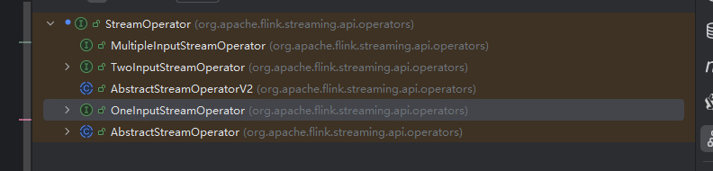
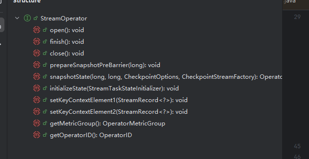
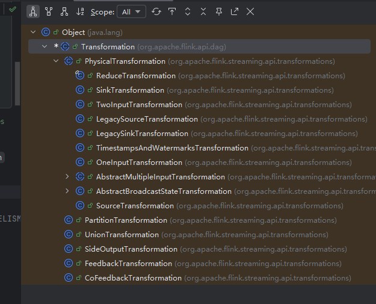

# Flink基础转换算子源码—Map源码解析

## Map源码解析第一部分：StreamMap和MapFunction

`Flink` 基本转换算子有3个：分别是 `Map`，`FlatMap` 和 `Filter`。以`Map`为例，深入研究下 `Map`是如何解析构造的。

通过源算子的获取可以知道，`Flink`通过 `addSource`和`fromSource`会产生 `DataStream`。而`DataStream`包含了各类方法，其中便有 `map`方法

1. 首先查看 `public <R> SingleOutputStreamOperator<R> map(MapFunction<T, R> mapper)`方法。该方法签名分别是接收一个 `MapFunction`类和返回一个 `SingleOutputStreamOperator`类。

   ~~~java
     public <R> SingleOutputStreamOperator<R> map(MapFunction<T, R> mapper) {
   
         //clean(mapper)是清理闭包
         //getMapReturnTypes做类型推断，获取匿名函数类（scala可以直接用 ClassTag，获取泛型的对象。从而抵消泛型擦除的影响）
           TypeInformation<R> outType =
                   TypeExtractor.getMapReturnTypes(
                           clean(mapper), getType(), Utils.getCallLocationName(), true);
   
         //map函数接收传入的 mapper和 outType。构建 SingleOutputStreamOperator
           return map(mapper, outType);
       }
   ~~~

2. 看`public <R> SingleOutputStreamOperator<R> map`的源码和 `MapFunction` 源码

   ~~~java
   
   // MapFunction 源码非常简单，只定义了一个方法。因此，默认可以用匿名类或者Lambda表达式实现
   @Public
   @FunctionalInterface
   public interface MapFunction<T, O> extends Function, Serializable {
   
       /**
        * The mapping method. Takes an element from the input data set and transforms it into exactly
        * one element.
        *
        * @param value The input value.
        * @return The transformed value
        * @throws Exception This method may throw exceptions. Throwing an exception will cause the
        *     operation to fail and may trigger recovery.
        */
       O map(T value) throws Exception;
   }
   
   //接着往下看 transform 的实现
   public <R> SingleOutputStreamOperator<R> map(
               MapFunction<T, R> mapper, TypeInformation<R> outputType) {
           return transform("Map", outputType, new StreamMap<>(clean(mapper)));
   }
   
   @PublicEvolving
       public <R> SingleOutputStreamOperator<R> transform(
               String operatorName,
               TypeInformation<R> outTypeInfo,
               OneInputStreamOperator<T, R> operator) {
   
           return doTransform(operatorName, outTypeInfo, SimpleOperatorFactory.of(operator));
       }
   
   //doTransform 才是最关键的实现方法。接收了3个参数，分别是 
   //operatorName：算子名称
   //outTypeInfo：输出类型
   //operatorFactory：定义的转换操作。由SimpleOperatorFactory.of生成
   protected <R> SingleOutputStreamOperator<R> doTransform(
               String operatorName,
               TypeInformation<R> outTypeInfo,
               StreamOperatorFactory<R> operatorFactory) {
   
       	//这个是获取上个输出流的类型。如果是在 SourceStream 后面，就SourceStream类型
           // read the output type of the input Transform to coax out errors about MissingTypeInfo
           transformation.getOutputType();
   
       	//构建 OneInputTransformation。transformation 依旧将最初的源 SourceStream 放在 transformation 这个变量。
           OneInputTransformation<T, R> resultTransform =
                   new OneInputTransformation<>(
                           this.transformation,
                           operatorName,
                           operatorFactory,
                           outTypeInfo,
                           environment.getParallelism());
   
           @SuppressWarnings({"unchecked", "rawtypes"})
           SingleOutputStreamOperator<R> returnStream =
                   new SingleOutputStreamOperator(environment, resultTransform);
   
           //这一步十分关键：相关的源码解析放在下面。
           getExecutionEnvironment().addOperator(resultTransform);
   
       	//最后返回 SingleOutputStreamOperator。
           return returnStream;
       }
   
   //getExecutionEnvironment的 addOperator 方法。本质上会流经过的 物理转换算子加入transformations。同时，通过每个算子的 ChainingStrategy 和
   // parparallelism 确定前后两个算子是否能链在一起。是flnk形成DAG的重要工具。
    @Internal
       public void addOperator(Transformation<?> transformation) {
           Preconditions.checkNotNull(transformation, "transformation must not be null.");
           this.transformations.add(transformation);
       }
   
   ~~~

3. `map`的转换操作还是十分清晰的。但是也可以在这个基础上，看下map的实现过程。分别继承了哪些类，这些类各自的作用。从而理解`Flink`源码的分层

4. 首先看下 `map` 函数的继承

   

5. `Function` 是 Flink 中最基础的函数接口，许多功能性接口（如 `MapFunction`、`FlatMapFunction`、`FilterFunction` 等）都继承自它，用于定义用户对流中数据的各种处理逻辑。

   - 其中，`SourceFunction` 是一种比较特殊的接口，它不仅负责从外部系统中**产生数据**，还需处理**水位线生成**、**checkpoint 协调**等复杂功能，这给开发者带来了较大的实现负担。
   - 为了简化这些开发流程，Flink 在新架构中引入了更加通用和强大的 `Source` 接口。该接口通过 `createEnumerator()` 和 `createReader()` 等机制，将**分片管理**、**数据读取**、**并行度控制**等职责明确分离，从而提升了可扩展性和一致性，也方便系统自动化处理数据分区和容错逻辑。

6. `FlatMapFunction`接口的定义也可以看下。和`Map`十分类似

   ~~~java
   @Public
   @FunctionalInterface
   public interface FlatMapFunction<T, O> extends Function, Serializable {
   
       /**
        * The core method of the FlatMapFunction. Takes an element from the input data set and
        * transforms it into zero, one, or more elements.
        *
        * @param value The input value.
        * @param out The collector for returning result values.
        * @throws Exception This method may throw exceptions. Throwing an exception will cause the
        *     operation to fail and may trigger recovery.
        */
       void flatMap(T value, Collector<O> out) throws Exception;
   }
   ~~~

7. 所有声明的 `Function` 都会被 `StramOperator` 调用。通过 `map` 源码可知：`new StreamMap<>(clean(mapper))` 这一步返回的是 `StreamMap`。而`Streamap`的继承路线可以概括成：`StreamMap` -> `AbstractUdfStreamOperator` ->`AbstractStreamOperator`->`StreamOperator`  和`StreamMap` -> `OneInputStreamOperator` ->`StreamOperator`

8. 看下 `StreamOperator`的继承关系

   

9. 先看下 `StreamOperator` 有哪些对象

   

   `StreamOperator` 是 Flink 中所有算子的基类接口，定义了算子的生命周期方法（如初始化 `open()`、关闭 `close()`、处理结束 `finish()` 等）。此外，它还支持：

   - **检查点（Checkpoint）**
   - **状态管理（State）**
   - **指标监控（Metrics）**
   - **Key 选择器（Key Selector）**

   `Flink` 默认支持两种算子输入类型：`OneInputStreamOperator` 和 `TwoInputStreamOperator`，分别用于处理单输入流和双输入流的场景。因此，`StreamOperator` 中预留了最多两个 `Key Selector` 接口，用于对左右两侧输入流分别提取 `key` 信息，以支持 `keyed state` 和 `keyed operator` 的语义。

10. `AbstractStreamOperator` 是 Flink 中流算子的核心抽象类，封装了大量通用的生命周期逻辑、状态管理、时间语义等操作。它实现了 `StreamOperator` 接口，并扩展了两个关键接口：

    - **`SetupableStreamOperator`**：用于访问 Flink 的运行时上下文，包括配置参数、KeySelector 设置、算子并行度等。
    - **`CheckpointedStreamOperator`**：用于支持算子的状态快照与恢复，是 Flink 容错机制的核心接口之一。

    从 Flink 1.15 开始，虽然引入了新的 `AbstractStreamOperatorV2` 类用于改进某些算子的生命周期控制与状态处理逻辑，但原有的 `AbstractStreamOperator` 并没有标记为 `@Deprecated`，仍是多数算子（如 `Map`、`FlatMap`、`KeyedProcess` 等）的基类。

    目前可以先对这几个类建立基本印象，等深入分析 `runtime` 模块与 `Checkpoint` 子系统时再详细解析。以下是 `SetupableStreamOperator` 和 `CheckpointedStreamOperator`实现类源码。

    ~~~java
    /**
     * Stream operators can implement this interface if they need access to the context and the output.
     *
     * @param <OUT> The output type of the operator
     * @deprecated This class is deprecated in favour of using {@link StreamOperatorFactory} and it's
     *     {@link StreamOperatorFactory#createStreamOperator} and passing the required parameters to the
     *     Operator's constructor in create method.
     */
    @Deprecated
    @PublicEvolving
    public interface SetupableStreamOperator<OUT> {
    
        /** Initializes the operator. Sets access to the context and the output. */
        void setup(
                StreamTask<?, ?> containingTask, StreamConfig config, Output<StreamRecord<OUT>> output);
    
        ChainingStrategy getChainingStrategy();
    
        void setChainingStrategy(ChainingStrategy strategy);
    }
    
    /**
     * Class encapsulating various state backend handling logic for {@link StreamOperator}
     * implementations.
     */
    @Internal
    public class StreamOperatorStateHandler {
    
        protected static final Logger LOG = LoggerFactory.getLogger(StreamOperatorStateHandler.class);
    
        /** Backend for keyed state. This might be empty if we're not on a keyed stream. */
        @Nullable private final CheckpointableKeyedStateBackend<?> keyedStateBackend;
    
        private final CloseableRegistry closeableRegistry;
        @Nullable private final DefaultKeyedStateStore keyedStateStore;
        private final OperatorStateBackend operatorStateBackend;
        private final StreamOperatorStateContext context;
    
        public StreamOperatorStateHandler(
                StreamOperatorStateContext context,
                ExecutionConfig executionConfig,
                CloseableRegistry closeableRegistry) {
            this.context = context;
            operatorStateBackend = context.operatorStateBackend();
            keyedStateBackend = context.keyedStateBackend();
            this.closeableRegistry = closeableRegistry;
    
            if (keyedStateBackend != null) {
                keyedStateStore = new DefaultKeyedStateStore(keyedStateBackend, executionConfig);
            } else {
                keyedStateStore = null;
            }
        }
    
        public void initializeOperatorState(CheckpointedStreamOperator streamOperator)
                throws Exception {
            CloseableIterable<KeyGroupStatePartitionStreamProvider> keyedStateInputs =
                    context.rawKeyedStateInputs();
            CloseableIterable<StatePartitionStreamProvider> operatorStateInputs =
                    context.rawOperatorStateInputs();
    
            try {
                OptionalLong checkpointId = context.getRestoredCheckpointId();
                StateInitializationContext initializationContext =
                        new StateInitializationContextImpl(
                                checkpointId.isPresent() ? checkpointId.getAsLong() : null,
                                operatorStateBackend, // access to operator state backend
                                keyedStateStore, // access to keyed state backend
                                keyedStateInputs, // access to keyed state stream
                                operatorStateInputs); // access to operator state stream
    
                streamOperator.initializeState(initializationContext);
            } finally {
                closeFromRegistry(operatorStateInputs, closeableRegistry);
                closeFromRegistry(keyedStateInputs, closeableRegistry);
            }
        }
    
        private static void closeFromRegistry(Closeable closeable, CloseableRegistry registry) {
            if (registry.unregisterCloseable(closeable)) {
                IOUtils.closeQuietly(closeable);
            }
        }
    
        public void dispose() throws Exception {
            try (Closer closer = Closer.create()) {
                if (closeableRegistry.unregisterCloseable(operatorStateBackend)) {
                    closer.register(operatorStateBackend);
                }
                if (closeableRegistry.unregisterCloseable(keyedStateBackend)) {
                    closer.register(keyedStateBackend);
                }
                if (operatorStateBackend != null) {
                    closer.register(operatorStateBackend::dispose);
                }
                if (keyedStateBackend != null) {
                    closer.register(keyedStateBackend::dispose);
                }
            }
        }
    
        public OperatorSnapshotFutures snapshotState(
                CheckpointedStreamOperator streamOperator,
                Optional<InternalTimeServiceManager<?>> timeServiceManager,
                String operatorName,
                long checkpointId,
                long timestamp,
                CheckpointOptions checkpointOptions,
                CheckpointStreamFactory factory,
                boolean isUsingCustomRawKeyedState)
                throws CheckpointException {
            KeyGroupRange keyGroupRange =
                    null != keyedStateBackend
                            ? keyedStateBackend.getKeyGroupRange()
                            : KeyGroupRange.EMPTY_KEY_GROUP_RANGE;
    
            OperatorSnapshotFutures snapshotInProgress = new OperatorSnapshotFutures();
    
            StateSnapshotContextSynchronousImpl snapshotContext =
                    new StateSnapshotContextSynchronousImpl(
                            checkpointId, timestamp, factory, keyGroupRange, closeableRegistry);
    
            snapshotState(
                    streamOperator,
                    timeServiceManager,
                    operatorName,
                    checkpointId,
                    timestamp,
                    checkpointOptions,
                    factory,
                    snapshotInProgress,
                    snapshotContext,
                    isUsingCustomRawKeyedState);
    
            return snapshotInProgress;
        }
    
        @VisibleForTesting
        void snapshotState(
                CheckpointedStreamOperator streamOperator,
                Optional<InternalTimeServiceManager<?>> timeServiceManager,
                String operatorName,
                long checkpointId,
                long timestamp,
                CheckpointOptions checkpointOptions,
                CheckpointStreamFactory factory,
                OperatorSnapshotFutures snapshotInProgress,
                StateSnapshotContextSynchronousImpl snapshotContext,
                boolean isUsingCustomRawKeyedState)
                throws CheckpointException {
            try {
                if (timeServiceManager.isPresent()) {
                    checkState(
                            keyedStateBackend != null,
                            "keyedStateBackend should be available with timeServiceManager");
                    final InternalTimeServiceManager<?> manager = timeServiceManager.get();
    
                    boolean requiresLegacyRawKeyedStateSnapshots =
                            keyedStateBackend instanceof AbstractKeyedStateBackend
                                    && ((AbstractKeyedStateBackend<?>) keyedStateBackend)
                                            .requiresLegacySynchronousTimerSnapshots(
                                                    checkpointOptions.getCheckpointType());
    
                    if (requiresLegacyRawKeyedStateSnapshots) {
                        checkState(
                                !isUsingCustomRawKeyedState,
                                "Attempting to snapshot timers to raw keyed state, but this operator has custom raw keyed state to write.");
                        manager.snapshotToRawKeyedState(
                                snapshotContext.getRawKeyedOperatorStateOutput(), operatorName);
                    }
                }
                streamOperator.snapshotState(snapshotContext);
    
                snapshotInProgress.setKeyedStateRawFuture(snapshotContext.getKeyedStateStreamFuture());
                snapshotInProgress.setOperatorStateRawFuture(
                        snapshotContext.getOperatorStateStreamFuture());
    
                if (null != operatorStateBackend) {
                    snapshotInProgress.setOperatorStateManagedFuture(
                            operatorStateBackend.snapshot(
                                    checkpointId, timestamp, factory, checkpointOptions));
                }
    
                if (null != keyedStateBackend) {
                    if (isCanonicalSavepoint(checkpointOptions.getCheckpointType())) {
                        SnapshotStrategyRunner<KeyedStateHandle, ? extends FullSnapshotResources<?>>
                                snapshotRunner =
                                        prepareCanonicalSavepoint(keyedStateBackend, closeableRegistry);
    
                        snapshotInProgress.setKeyedStateManagedFuture(
                                snapshotRunner.snapshot(
                                        checkpointId, timestamp, factory, checkpointOptions));
    
                    } else {
                        snapshotInProgress.setKeyedStateManagedFuture(
                                keyedStateBackend.snapshot(
                                        checkpointId, timestamp, factory, checkpointOptions));
                    }
                }
            } catch (Exception snapshotException) {
                try {
                    snapshotInProgress.cancel();
                } catch (Exception e) {
                    snapshotException.addSuppressed(e);
                }
    
                String snapshotFailMessage =
                        "Could not complete snapshot "
                                + checkpointId
                                + " for operator "
                                + operatorName
                                + ".";
    
                try {
                    snapshotContext.closeExceptionally();
                } catch (IOException e) {
                    snapshotException.addSuppressed(e);
                }
                throw new CheckpointException(
                        snapshotFailMessage,
                        CheckpointFailureReason.CHECKPOINT_DECLINED,
                        snapshotException);
            }
        }
    
        private boolean isCanonicalSavepoint(SnapshotType snapshotType) {
            return snapshotType.isSavepoint()
                    && ((SavepointType) snapshotType).getFormatType() == SavepointFormatType.CANONICAL;
        }
    
        @Nonnull
        public static SnapshotStrategyRunner<KeyedStateHandle, ? extends FullSnapshotResources<?>>
                prepareCanonicalSavepoint(
                        CheckpointableKeyedStateBackend<?> keyedStateBackend,
                        CloseableRegistry closeableRegistry)
                        throws Exception {
            SavepointResources<?> savepointResources = keyedStateBackend.savepoint();
    
            SavepointSnapshotStrategy<?> savepointSnapshotStrategy =
                    new SavepointSnapshotStrategy<>(savepointResources.getSnapshotResources());
    
            return new SnapshotStrategyRunner<>(
                    "Asynchronous full Savepoint",
                    savepointSnapshotStrategy,
                    closeableRegistry,
                    savepointResources.getPreferredSnapshotExecutionType());
        }
    
        public void notifyCheckpointComplete(long checkpointId) throws Exception {
            if (keyedStateBackend instanceof CheckpointListener) {
                ((CheckpointListener) keyedStateBackend).notifyCheckpointComplete(checkpointId);
            }
        }
    
        public void notifyCheckpointAborted(long checkpointId) throws Exception {
            if (keyedStateBackend instanceof CheckpointListener) {
                ((CheckpointListener) keyedStateBackend).notifyCheckpointAborted(checkpointId);
            }
        }
    
        @SuppressWarnings("unchecked")
        public <K> KeyedStateBackend<K> getKeyedStateBackend() {
            return (KeyedStateBackend<K>) keyedStateBackend;
        }
    
        public OperatorStateBackend getOperatorStateBackend() {
            return operatorStateBackend;
        }
    
        public <N, S extends State, T> S getOrCreateKeyedState(
                TypeSerializer<N> namespaceSerializer, StateDescriptor<S, T> stateDescriptor)
                throws Exception {
    
            if (keyedStateBackend != null) {
                return keyedStateBackend.getOrCreateKeyedState(namespaceSerializer, stateDescriptor);
            } else {
                throw new IllegalStateException(
                        "Cannot create partitioned state. "
                                + "The keyed state backend has not been set."
                                + "This indicates that the operator is not partitioned/keyed.");
            }
        }
    
        /**
         * Creates a partitioned state handle, using the state backend configured for this task.
         *
         * @throws IllegalStateException Thrown, if the key/value state was already initialized.
         * @throws Exception Thrown, if the state backend cannot create the key/value state.
         */
        protected <S extends State, N> S getPartitionedState(
                N namespace,
                TypeSerializer<N> namespaceSerializer,
                StateDescriptor<S, ?> stateDescriptor)
                throws Exception {
    
            /*
            TODO: NOTE: This method does a lot of work caching / retrieving states just to update the namespace.
            This method should be removed for the sake of namespaces being lazily fetched from the keyed
            state backend, or being set on the state directly.
            */
    
            if (keyedStateBackend != null) {
                return keyedStateBackend.getPartitionedState(
                        namespace, namespaceSerializer, stateDescriptor);
            } else {
                throw new RuntimeException(
                        "Cannot create partitioned state. The keyed state "
                                + "backend has not been set. This indicates that the operator is not "
                                + "partitioned/keyed.");
            }
        }
    
        @SuppressWarnings({"unchecked"})
        public void setCurrentKey(Object key) {
            if (keyedStateBackend != null) {
                try {
                    // need to work around type restrictions
                    @SuppressWarnings("rawtypes")
                    CheckpointableKeyedStateBackend rawBackend = keyedStateBackend;
    
                    rawBackend.setCurrentKey(key);
                } catch (Exception e) {
                    throw new RuntimeException(
                            "Exception occurred while setting the current key context.", e);
                }
            }
        }
    
        public Object getCurrentKey() {
            if (keyedStateBackend != null) {
                return keyedStateBackend.getCurrentKey();
            } else {
                throw new UnsupportedOperationException("Key can only be retrieved on KeyedStream.");
            }
        }
    
        public Optional<KeyedStateStore> getKeyedStateStore() {
            return Optional.ofNullable(keyedStateStore);
        }
    
        /** Custom state handling hooks to be invoked by {@link StreamOperatorStateHandler}. */
        public interface CheckpointedStreamOperator {
            void initializeState(StateInitializationContext context) throws Exception;
    
            void snapshotState(StateSnapshotContext context) throws Exception;
        }
    }
    ~~~

11. 终于到了看 `AbstractUdfStreamOperator`类了，有了上述 `StreamOperator`和`AbstractStreamOperator`两个类的铺垫。`AbstractUdfStreamOperator`的实现十分简单。重点关注 `userFunction` 对象。`userFunction`是用户真正定义的`Flink`函数。`F extends Function`确保了只能是`Function`的子类

    ~~~java
    @PublicEvolving
    public abstract class AbstractUdfStreamOperator<OUT, F extends Function>
            extends AbstractStreamOperator<OUT> implements OutputTypeConfigurable<OUT> {
    
        private static final long serialVersionUID = 1L;
    
        /** The user function. */
        protected final F userFunction;
    
        public AbstractUdfStreamOperator(F userFunction) {
            this.userFunction = requireNonNull(userFunction);
            checkUdfCheckpointingPreconditions();
        }
    
        /**
         * Gets the user function executed in this operator.
         *
         * @return The user function of this operator.
         */
        public F getUserFunction() {
            return userFunction;
        }
    
        // ------------------------------------------------------------------------
        //  operator life cycle
        // ------------------------------------------------------------------------
    
        @Override
        public void setup(
                StreamTask<?, ?> containingTask,
                StreamConfig config,
                Output<StreamRecord<OUT>> output) {
            super.setup(containingTask, config, output);
            FunctionUtils.setFunctionRuntimeContext(userFunction, getRuntimeContext());
        }
    
        @Override
        public void snapshotState(StateSnapshotContext context) throws Exception {
            super.snapshotState(context);
            StreamingFunctionUtils.snapshotFunctionState(
                    context, getOperatorStateBackend(), userFunction);
        }
    
        @Override
        public void initializeState(StateInitializationContext context) throws Exception {
            super.initializeState(context);
            StreamingFunctionUtils.restoreFunctionState(context, userFunction);
        }
    
        @Override
        public void open() throws Exception {
            super.open();
            FunctionUtils.openFunction(userFunction, new Configuration());
        }
    
        @Override
        public void finish() throws Exception {
            super.finish();
            if (userFunction instanceof SinkFunction) {
                ((SinkFunction<?>) userFunction).finish();
            }
        }
    
        @Override
        public void close() throws Exception {
            super.close();
            FunctionUtils.closeFunction(userFunction);
        }
    
        // ------------------------------------------------------------------------
        //  checkpointing and recovery
        // ------------------------------------------------------------------------
    
        @Override
        public void notifyCheckpointComplete(long checkpointId) throws Exception {
            super.notifyCheckpointComplete(checkpointId);
    
            if (userFunction instanceof CheckpointListener) {
                ((CheckpointListener) userFunction).notifyCheckpointComplete(checkpointId);
            }
        }
    
        @Override
        public void notifyCheckpointAborted(long checkpointId) throws Exception {
            super.notifyCheckpointAborted(checkpointId);
    
            if (userFunction instanceof CheckpointListener) {
                ((CheckpointListener) userFunction).notifyCheckpointAborted(checkpointId);
            }
        }
    
        // ------------------------------------------------------------------------
        //  Output type configuration
        // ------------------------------------------------------------------------
    
        @Override
        public void setOutputType(TypeInformation<OUT> outTypeInfo, ExecutionConfig executionConfig) {
            StreamingFunctionUtils.setOutputType(userFunction, outTypeInfo, executionConfig);
        }
    
        // ------------------------------------------------------------------------
        //  Utilities
        // ------------------------------------------------------------------------
    
        /**
         * Since the streaming API does not implement any parametrization of functions via a
         * configuration, the config returned here is actually empty.
         *
         * @return The user function parameters (currently empty)
         */
        public Configuration getUserFunctionParameters() {
            return new Configuration();
        }
    
        private void checkUdfCheckpointingPreconditions() {
    
            if (userFunction instanceof CheckpointedFunction
                    && userFunction instanceof ListCheckpointed) {
    
                throw new IllegalStateException(
                        "User functions are not allowed to implement "
                                + "CheckpointedFunction AND ListCheckpointed.");
            }
        }
    }
    ~~~

12. `StreamMap`实现更加简单。就是将用户自己的 `MapFunction` 真正赋予 `AbstractUdfStreamOperator.userFunction` 字段上。

    ~~~java
    A StreamOperator for executing MapFunctions.
    @Internal
    public class StreamMap<IN, OUT> extends AbstractUdfStreamOperator<OUT, MapFunction<IN, OUT>>
            implements OneInputStreamOperator<IN, OUT> {
    
        private static final long serialVersionUID = 1L;
    
        public StreamMap(MapFunction<IN, OUT> mapper) {
            super(mapper);
            chainingStrategy = ChainingStrategy.ALWAYS;
        }
    
        @Override
        public void processElement(StreamRecord<IN> element) throws Exception {
            output.collect(element.replace(userFunction.map(element.getValue())));
        }
    }
    ~~~

13. 然后重点看下 `SimpleOperatorFactory.of(operator)` 。这个方法是将 `streamOperate` 根据不同的类型进行包装。

    ~~~JAVA
    public static <OUT> SimpleOperatorFactory<OUT> of(StreamOperator<OUT> operator) {
            if (operator == null) {
                return null;
            } else if (operator instanceof StreamSource
                    && ((StreamSource) operator).getUserFunction()
                            instanceof InputFormatSourceFunction) {
                return new SimpleInputFormatOperatorFactory<OUT>((StreamSource) operator);
            } else if (operator instanceof StreamSink
                    && ((StreamSink) operator).getUserFunction() instanceof OutputFormatSinkFunction) {
                return new SimpleOutputFormatOperatorFactory<>((StreamSink) operator);
            } else if (operator instanceof AbstractUdfStreamOperator) {
                return new SimpleUdfStreamOperatorFactory<OUT>((AbstractUdfStreamOperator) operator);
            } else {
                return new SimpleOperatorFactory<>(operator);
            }
        }
    ~~~

    

14. 最后看 `doTransform` 方法。

    ~~~java
    protected <R> SingleOutputStreamOperator<R> doTransform(
                String operatorName,
                TypeInformation<R> outTypeInfo,
                StreamOperatorFactory<R> operatorFactory) {
    
            // read the output type of the input Transform to coax out errors about MissingTypeInfo
            transformation.getOutputType();
    
    		//将用户定义的streamOperator转换成 Transformation
            OneInputTransformation<T, R> resultTransform =
                    new OneInputTransformation<>(
                            this.transformation,
                            operatorName,
                            operatorFactory,
                            outTypeInfo,
                            environment.getParallelism());
    
            @SuppressWarnings({"unchecked", "rawtypes"})
            SingleOutputStreamOperator<R> returnStream =
                    new SingleOutputStreamOperator(environment, resultTransform);
    
    		//这一步将 Transformation 添加到 Transformations。用来构成作业的DAG
            getExecutionEnvironment().addOperator(resultTransform);
    
            return returnStream;
        }
    ~~~

15. 通过`map`算子和`socketSource`算子，可以看出。

    1. 在 Flink 中，数据处理的最基本执行单元是 **Function**，例如 `MapFunction`、`FlatMapFunction` 等。这些 Function 由用户定义，用于指定具体的数据计算逻辑。Flink 会将 Function 封装为一个 **Operator**，该算子负责管理并行度、状态、检查点（Checkpoint）等运行时信息。
    2. 接下来，Operator 会被进一步封装为 **Transformation**，代表一次逻辑上的数据转换操作。在实际使用中，用户通过诸如 `.map()`、`.flatMap()` 等 API 调用，这些都会被转换为对应的 Transformation 对象（如 `MapTransformation`、`FlatMapTransformation`）。Transformation 是 Flink 构建流处理拓扑（DAG）的关键组成部分。
    3. 这些 Transformation 最终会构成一个 **StreamGraph**，再被优化并转化为 Flink 运行时使用的 **JobGraph**，提交到集群执行。

    ​	

# source算子、sink算子、转换算子位置

1. `source`算子，`sink`算子和转换算子都存放在 `flink-core`包底下。
   - `source`算子：`flink-core` 的`.\api\connector`
   - `sink`算子：同上
   - `functions`：`flink-core`  的 `.\api\common\Function`
   - `operators`  ：`flink-core`  的`.\api\common\operators` 
   - `StreamOperatorFactory`：`flink-streaming-java`  的 `org.apache.flink.streaming.operators`
   - `Transformations`：同上
2. 通过以上位置分布，不难看出：
   1. Flink 将编程接口与执行逻辑清晰分层：`source`、`sink`、`functions`、`operators` 等核心接口被定义在 `flink-core` 模块中，作为通用的 API 抽象，独立于具体运行环境；而实际的执行逻辑，如 `StreamOperatorFactory` 和各类 `Transformation`，则实现于 `flink-streaming-java` 模块中，负责将用户的逻辑转换为可执行的任务。
