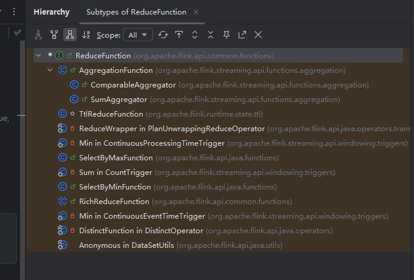

# `Flink`基础转换算子源码— `KeyBy`、`max`和`connect`算子

## `KeyBy`算子

算子

1. 首先看示例：`keyBy`根据传入的数据进行分组。这里是根据性别

   ~~~java
   StreamExecutionEnvironment env = StreamExecutionEnvironment.getExecutionEnvironment();
           env.setParallelism(1);
   
           DataStreamSource<Tuple3<String, String, Integer>> stu = env.fromElements(
                   new Tuple3<>("孙悟空", "M", 25),
                   new Tuple3<>("孙悟空", "M", 27),
                   new Tuple3<>("孙悟饭", "M", 29),
                   new Tuple3<>("孙悟饭", "M", 24),
                   new Tuple3<>("雅目茶", "M", 29),
                   new Tuple3<>("雅目茶", "M", 25),
                   new Tuple3<>("奥特曼", "W", 27),
                   new Tuple3<>("奥特曼", "W", 29),
                   new Tuple3<>("琪琪", "W", 24),
                   new Tuple3<>("琪琪", "W", 29)
           );
   
           // 按照性别进行分组
           KeyedStream<Tuple3<String, String, Integer>, String> keyed = stu.keyBy(tup -> tup.f1);
           // 使用max算子求最大值
           SingleOutputStreamOperator<Tuple3<String, String, Integer>> maxStream = keyed.max(2);
           // 使用maxBy算子求最大值
           // SingleOutputStreamOperator<Tuple3<String, String, Integer>> maxStream = keyed.maxBy(2);
           // 打印数据
           maxStream.shuffle().print();
           env.execute();
   ~~~

2. 点进去 `keyBy` 方法，可以看到它需要一个 `KeySelector` 对象。`KeySelector` 是一个函数式接口，继承了 Flink 的 `Function` 接口，并定义了一个 `getKey(T value)` 方法用于提取 key。调用 `keyBy` 返回一个 `KeyedStream`，它不会立即将新的 `Transformation` 添加到 `StreamExecutionEnvironment` 的 `transformations` 列表中，而是返回一个流对象，并将内部生成的 `PartitionTransformation` 保存在 `KeyedStream` 的 `transformation` 字段中。

   ~~~java
   public <K> KeyedStream<T, K> keyBy(KeySelector<T, K> key) {
           Preconditions.checkNotNull(key);
           return new KeyedStream<>(this, clean(key));
       }
   
   public interface KeySelector<IN, KEY> extends Function, Serializable {
       KEY getKey(IN value) throws Exception;
   }
   
   //返回一个 PartitionTransformation 对象
   public KeyedStream(
               DataStream<T> dataStream,
               KeySelector<T, KEY> keySelector,
               TypeInformation<KEY> keyType) {
           this(
                   dataStream,
                   new PartitionTransformation<>(
                           dataStream.getTransformation(),
                           new KeyGroupStreamPartitioner<>(
                                   keySelector,
                                   StreamGraphGenerator.DEFAULT_LOWER_BOUND_MAX_PARALLELISM)),
                   keySelector,
                   keyType);
       }
   
   ~~~

## `max`算子

1. 接下来看 `max` 方法。该方法本质上先构造一个 `ComparableAggregator` 对象。该对象继承自 `ReduceFunction` 接口。以下是接口截图：

   

   ​	1.  `FieldAccessor<T, Object> fieldAccessor`这个方法还会构造一个 `fieldAccessor` 对象。该对象用来提供`get` 方法，获取对应需要`reduce`的对象。可以自行看一下实现方法。主要提供了 `java`的基类或者`flink`的`tuple`对象。最终返回一个 `ComparableAggregator`对象。该对象继承自`ReduceFunction`接口。

   ~~~java
   	public SingleOutputStreamOperator<T> max(int positionToMax) {
           return aggregate(
                   new ComparableAggregator<>(
                           positionToMax,
                           getType(),
                           AggregationFunction.AggregationType.MAX,
                           getExecutionConfig()));
       }
   
   public ComparableAggregator(
               int positionToAggregate,
               TypeInformation<T> typeInfo,
               AggregationType aggregationType,
               ExecutionConfig config) {
           this(positionToAggregate, typeInfo, aggregationType, false, config);
       }
       
       public ComparableAggregator(
               int positionToAggregate,
               TypeInformation<T> typeInfo,
               AggregationType aggregationType,
               boolean first,
               ExecutionConfig config) {
           this(
                   aggregationType,
                   FieldAccessorFactory.getAccessor(typeInfo, positionToAggregate, config),
                   first);
       }
       
       
        private ComparableAggregator(
               AggregationType aggregationType,
               FieldAccessor<T, Object> fieldAccessor,
               boolean first) {
           this.comparator = Comparator.getForAggregation(aggregationType);
           this.byAggregate =
                   (aggregationType == AggregationType.MAXBY)
                           || (aggregationType == AggregationType.MINBY);
           this.first = first;
           this.fieldAccessor = fieldAccessor;
       }
   ~~~

   2. 看一下`ComparableAggregator` 的`reduce`方法。实现非常简单，通过 fieldAccessor 获取 value的值，并进行比较。最终返回较大的值。这里需要注意的是`fieldAccessor.get(value1)`;方法返回的对象 `o1`必须实现了 `Comparable`接口。

      ~~~java
      @Override
          public T reduce(T value1, T value2) throws Exception {
              Comparable<Object> o1 = (Comparable<Object>) fieldAccessor.get(value1);
              Object o2 = fieldAccessor.get(value2);
      
              int c = comparator.isExtremal(o1, o2);
      
              if (byAggregate) {
                  // if they are the same we choose based on whether we want to first or last
                  // element with the min/max.
                  if (c == 0) {
                      return first ? value1 : value2;
                  }
      
                  return c == 1 ? value1 : value2;
      
              } else {
                  if (c == 0) {
                      value1 = fieldAccessor.set(value1, o2);
                  }
                  return value1;
              }
          }
      ~~~

   3. 通过reduce方法可以发现，该接口其实比较的是两两相依的对象。然后给下游输出一个对象。另外还可以看到 `AggregationFunction`对象。继承自`ReduceFunction`。并且有4个`AggregationType`的`enum`对象。

      ~~~java
      `@Internal
      public abstract class AggregationFunction<T> implements ReduceFunction<T> {
          private static final long serialVersionUID = 1L;
      
          /** Aggregation types that can be used on a windowed stream or keyed stream. */
          public enum AggregationType {
              SUM,
              MIN,
              MAX,
              MINBY,
              MAXBY,
          }
      }
      ~~~

   4. 总结：

      1. `Flink` 抽象了 `ReduceFunction<T>` 接口，它定义了两个相同类型对象的聚合逻辑，通常是将历史状态值与新输入进行合并。像 `maxBy` 等函数，就是通过内部实现的 `ReduceFunction` 来比较特定字段的大小，进而实现按字段取最大值的效果。内部通过 `fieldAccessor` 提取比较字段。
      2. `keyBy` 是 `Flink` 中用于按 key 对流数据进行逻辑分区的算子，它不会改变数据内容，而是为后续算子提供每个 `key` 独立状态的能力。每个下游算子在运行时会根据 `keyBy` 的分区逻辑，获取当前元素对应的 `key`，并访问与该 key 关联的状态。状态的管理由 `Flink` 的 `Runtime` 环境（例如 `StreamTask`, `Operator`, `StateBackend`）完成。这里不细讲。可以先记着。
      3. 换句话说，每个 `key` 都会拥有自己的独立状态，用于保存中间聚合结果或其他逻辑信息。由于 `Flink` 面向的是无限数据流，为了避免状态无限增长导致内存泄漏，通常需要为状态设置 `TTL`（`Time to Live`），让长时间未访问的状态自动清除。而在批处理场景下，由于数据有界，可以不设置 `TTL`。
      4. `Flink` 在运行时会通过用户提供的 `KeySelector#getKey` 方法，从每条数据中提取 `key`，然后根据该 `key`查找或创建对应的状态。在此基础上，调用 `reduce` 函数对已有状态值和当前输入进行聚合，最终更新状态并输出结果。

## `connect`算子

1. `connect`算子源码，这个方法接收1个参数。是另外一个需要`connect`的`dataStream`

   ~~~java
   public <R> ConnectedStreams<T, R> connect(DataStream<R> dataStream) {
           return new ConnectedStreams<>(environment, this, dataStream);
       }
   ~~~

2. 实现ConnectedStreams类非常简单。就是将不同的流赋予不同的对象，`inpputStream1`和`inputStream2`

   ~~~java
    protected ConnectedStreams(
               StreamExecutionEnvironment env, DataStream<IN1> input1, DataStream<IN2> input2) {
           this.environment = requireNonNull(env);
           this.inputStream1 = requireNonNull(input1);
           this.inputStream2 = requireNonNull(input2);
       }
   ~~~

3. 至于返回的 `ConnectedStreams`则用 独属于`ConnectedFunction`实现处理逻辑。最典型的是`CoMapFunction`。

   ~~~java
   /**
    * A CoFlatMapFunction implements a map() transformation over two connected streams.
    *
    * 
The same instance of the transformation function is used to transform both of the connected
    * streams. That way, the stream transformations can share state.
    *
    * @param <IN1> Type of the first input.
    * @param <IN2> Type of the second input.
    * @param <OUT> Output type.
    */
   @Public
   public interface CoMapFunction<IN1, IN2, OUT> extends Function, Serializable {
   
       /**
        * This method is called for each element in the first of the connected streams.
        *
        * @param value The stream element
        * @return The resulting element
        * @throws Exception The function may throw exceptions which cause the streaming program to fail
        *     and go into recovery.
        */
       OUT map1(IN1 value) throws Exception;
   
       /**
        * This method is called for each element in the second of the connected streams.
        *
        * @param value The stream element
        * @return The resulting element
        * @throws Exception The function may throw exceptions which cause the streaming program to fail
        *     and go into recovery.
        */
       OUT map2(IN2 value) throws Exception;
   }
   ~~~

   
