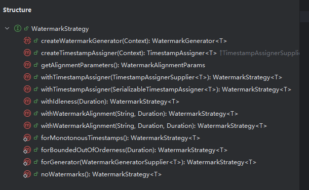
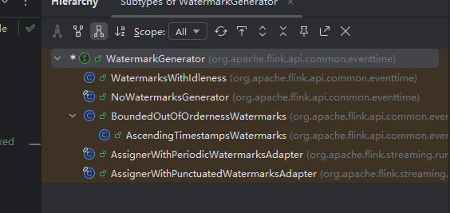
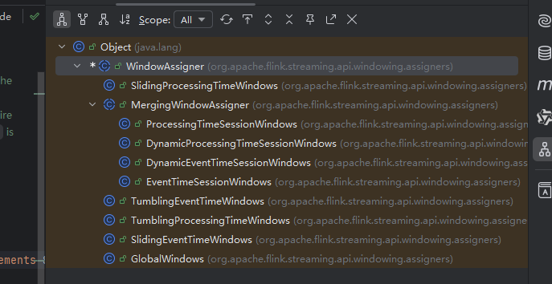

# `Watermark`，分流和`Join`

## 前置

`flink`的函数还有 `richFunction`和`ProcessFunction`。

- `RichFunction` 是 `Flink` 提供的函数“富化”版本，拥有生命周期方法（如 `open()`、`close()`），可以访问运行时上下文（如 `RuntimeContext`），适用于需要初始化资源或访问状态的场景。
- `ProcessFunction` 则是一个更底层、灵活度更高的函数，它可以处理每条输入记录，并配合定时器（`TimerService`）进行复杂的事件驱动逻辑，常用于流处理中的高级控制，比如延迟计算、超时判断等。
- 这些函数常常在底层的 `DataStream API` 中使用，但在 `Table API / SQL` 中也有其对应的实现逻辑。尤其在实现如 **表间 `Join`、`Interval Join`、`Temporal Join`、`Lookup Join`** 等语义时，`Flink` 内部通常借助 `ProcessFunction`（或类似的底层算子）来完成。
- 简单来说，表之间的复杂关系（特别是需要状态和定时控制的）通常是在底层通过 ProcessFunction 来实现的。

相比之下，基于 **窗口（`window`）的 `join`** 或聚合等操作，由于窗口会自动管理状态的生命周期（比如过期数据的清理），因此实现相对简单，用户也无需手动管理数据保留或清理逻辑。有兴趣自己可以看下使用方法。

## `WaterMark`使用方法

1. `Flink`内部通常会指定一个`WaterMark`的策略。然后在某个`stream`进行分配。

   ~~~java
   WatermarkStrategy
                   .<Event>forMonotonousTimestamps()
                   .withTimestampAssigner(new SerializableTimestampAssigner<Event>() {
                       @Override
                       public long extractTimestamp(Event element, long recordTimestamp) {
                           return element.getTimestamp();
                       }
                   });
   ~~~

2. 先看下 `WaterMark`的组成

   

   - `forMonotonousTimestamps`：适用于 **事件时间严格单调递增** 的场景。此策略假定数据不会乱序，因此每条数据的时间戳都比上一条大，**水位线等于当前事件时间戳**。
   - `forBoundedOutOfOrderness`：用于处理 **有界乱序（Bounded Out-of-Orderness）** 的数据流。此策略允许事件有最多 `maxOutOfOrderness` 的延迟，**水位线 = 当前最大时间戳 - 最大延迟**。
   - `forGenerator`：允许用户自定义水位线生成逻辑。适用于复杂的乱序场景或需要特殊处理的业务逻辑，例如根据字段分组生成水位线、跳跃式推进等。
   - `noWatermarks`：不生成任何水位线。**系统不会以事件时间驱动窗口计算**，适合不依赖事件时间语义的场景（如纯处理时间计算）。

3. 以 `forBoundedOutOfOrderness`为例，看下`flink core`模块是如何实现的

   ~~~java
   static <T> WatermarkStrategy<T> forBoundedOutOfOrderness(Duration maxOutOfOrderness) {
           return (ctx) -> new BoundedOutOfOrdernessWatermarks<>(maxOutOfOrderness);
       }
   
   @Public
   public class BoundedOutOfOrdernessWatermarks<T> implements WatermarkGenerator<T> {
   
       /** The maximum timestamp encountered so far. */
       private long maxTimestamp;
   
       /** The maximum out-of-orderness that this watermark generator assumes. */
       private final long outOfOrdernessMillis;
   
       /**
        * Creates a new watermark generator with the given out-of-orderness bound.
        *
        * @param maxOutOfOrderness The bound for the out-of-orderness of the event timestamps.
        */
       public BoundedOutOfOrdernessWatermarks(Duration maxOutOfOrderness) {
           checkNotNull(maxOutOfOrderness, "maxOutOfOrderness");
           checkArgument(!maxOutOfOrderness.isNegative(), "maxOutOfOrderness cannot be negative");
   
           this.outOfOrdernessMillis = maxOutOfOrderness.toMillis();
   
           // start so that our lowest watermark would be Long.MIN_VALUE.
           this.maxTimestamp = Long.MIN_VALUE + outOfOrdernessMillis + 1;
       }
   
       // ------------------------------------------------------------------------
   
       @Override
       public void onEvent(T event, long eventTimestamp, WatermarkOutput output) {
           maxTimestamp = Math.max(maxTimestamp, eventTimestamp);
       }
   
       @Override
       public void onPeriodicEmit(WatermarkOutput output) {
           output.emitWatermark(new Watermark(maxTimestamp - outOfOrdernessMillis - 1));
       }
   }
   ~~~

4. 可以看到 `BoundedOutOfOrdernessWatermarks` 继承自 `WatermarkGenerator`。而`WatermarkGenerator`的`UML`图如下：

   

   - 代码如下：

     ~~~java
     @Public
     public interface WatermarkGenerator<T> {
     
         /**
          * Called for every event, allows the watermark generator to examine and remember the event
          * timestamps, or to emit a watermark based on the event itself.
          */
         void onEvent(T event, long eventTimestamp, WatermarkOutput output);
     
         /**
          * Called periodically, and might emit a new watermark, or not.
          *
          * 
The interval in which this method is called and Watermarks are generated depends on {@link
          * ExecutionConfig#getAutoWatermarkInterval()}.
          */
         void onPeriodicEmit(WatermarkOutput output);
     }
     ~~~

   - 该函数接口声明了两个方法。`onEvent`一个是来一条数据发一条`Warkmark`。而`onPeriodicEmit`则是周期发送。而`BoundedOutOfOrdernessWatermarks`实现非常简单。则是 内部维护了一个`maxTimestamp`，定期发送最大的`maxTimestamp`。从而确保数据局部无序。 

5. 再细看一下`withTimestampAssigner`方法。该方法接收一个 `SerializableTimestampAssigner`对象。这个通常是用户自己写的，用来提取事件时间。

   ~~~java
   default WatermarkStrategy<T> withTimestampAssigner(
               SerializableTimestampAssigner<T> timestampAssigner) {
           checkNotNull(timestampAssigner, "timestampAssigner");
           return new WatermarkStrategyWithTimestampAssigner<>(
                   this, TimestampAssignerSupplier.of(timestampAssigner));
       }
   ~~~

6. 而且这个还牵扯到了`java`的`Supplier` 设计方法。但其实有点过于抽象了，如果和`scala`的`kafka`源码相比，我认为太过于抽象。主要这代码左包一层，右包一层的，看的太难受了。

   1. 用户只需要实现自己的 `WatermarkGenerator` 和 `TimestampAssigner`：

      - `WatermarkGenerator` 用于定义生成水位线（Watermark）的策略；
      - `TimestampAssigner` 用于从事件中提取事件时间（Event Time）。

      然后将这两者通过 `WatermarkStrategy` 注册给 Flink。Flink 在实际执行时，会调用 `WatermarkStrategy.createWatermarkGenerator(...)` 和 `createTimestampAssigner(...)` 方法，为每个并行任务分别创建对应的实例。

   2. 这里贴一下`Kafka`的`broker`端的索引懒加载方法，大家可以看下。感受下，`scala`的源码实现独特的地方。`LazyInde`需要两个参数分别是 `indexWrapper` 和 `loadIndex`。只有在`get`的时候，才会真正将`index`文件加载进内存。

      ~~~scala
      class LazyIndex[T <: AbstractIndex] private (@volatile private var indexWrapper: IndexWrapper, loadIndex: File => T) {
      
        private val lock = new ReentrantLock()
      
        def file: File = indexWrapper.file
      
        def get: T = {
          indexWrapper match {
            case indexValue: IndexValue[T] => indexValue.index
            case _: IndexFile =>
              inLock(lock) {
                indexWrapper match {
                  case indexValue: IndexValue[T] => indexValue.index
                  case indexFile: IndexFile =>
                    val indexValue = new IndexValue(loadIndex(indexFile.file))
                    indexWrapper = indexValue
                    indexValue.index
                }
              }
          }
        }
      
        def updateParentDir(parentDir: File): Unit = {
          inLock(lock) {
            indexWrapper.updateParentDir(parentDir)
          }
        }
      
        def renameTo(f: File): Unit = {
          inLock(lock) {
            indexWrapper.renameTo(f)
          }
        }
      
        def deleteIfExists(): Boolean = {
          inLock(lock) {
            indexWrapper.deleteIfExists()
          }
        }
      
        def close(): Unit = {
          inLock(lock) {
            indexWrapper.close()
          }
        }
      
        def closeHandler(): Unit = {
          inLock(lock) {
            indexWrapper.closeHandler()
          }
        }
      
      }
      ~~~

## 分流

1. 分流本身逻辑比较简单，关键在于它是如何被使用的。里面涉及的 `ProcessFunction` 和 `KeyedProcessFunction`，我打算放到 `Table API` 或 `Runtime` 层来讲解。其实，这些 `Process` 函数就是借助 `Flink` 的运行时上下文（`Context`）来执行具体操作，而这个 `Context` 正是 `Flink Runtime` 运行的核心体现。

   ~~~java
   StreamExecutionEnvironment env = StreamExecutionEnvironment.getExecutionEnvironment();
   
           /**
            * 创建OutputTag对象，用于盛装侧输出流的数据
            * 第一个参数： 标签名
            * 第二个参数：放入侧输出流中的数据的类型。 TypeInformation
            */
           OutputTag<Tuple2<Integer, Integer>> s1Tag = new OutputTag<>("s1", Types.TUPLE(Types.INT,Types.INT));
           OutputTag<Tuple2<Integer, Integer>> s2Tag = new OutputTag<>("s2",Types.TUPLE(Types.INT,Types.INT));
   
           DataStreamSource<Tuple2<Integer, Integer>> dataDS = env.fromElements(Tuple2.of(1, 22), Tuple2.of(1, 24), Tuple2.of(2, 0), Tuple2.of(2, 7));
           /**
            * 使用测输出流实现分流
            */
           SingleOutputStreamOperator<Tuple2<Integer, Integer>> process = dataDS.process(new ProcessFunction<Tuple2<Integer, Integer>, Tuple2<Integer, Integer>>() {
               @Override
               public void processElement(Tuple2<Integer, Integer> value, ProcessFunction<Tuple2<Integer, Integer>, Tuple2<Integer, Integer>>.Context ctx, Collector<Tuple2<Integer, Integer>> out) throws Exception {
                   if(value.f0 == 1){
                       //如果是1的数据，放到侧输出流s1中
   
                       /**
                        * 上下文调用output，将数据放入侧输出流
                        * 第一个参数：侧输出流对象
                        * 第二个参数：放入到侧输出流中的数据
                        */
                       ctx.output(s1Tag,value);
                   } else if(value.f0 == 2){
                       //如果是2的数据，放到侧输出流s2中
                       ctx.output(s2Tag,value);
                   } else{
                       // 非 1和2的数据，放到主流中
                       out.collect(value);
                   }
               }
           });
   
           // 打印主流的数据
           process.print("main");
   
           // 打印侧输出流
           process.getSideOutput(s1Tag).print("s1");
           process.getSideOutput(s2Tag).print("s2");
           env.execute();
   ~~~

2. 声明一个 `Output`，然后在 `process` 方法里通过 `ctx.output` 访问它。这个过程中用到了闭包的特性。前面提到过 Flink 对闭包的清理，这里用到的闭包和之前说的其实是同一个概念，但清理的对象不同。这其中还涉及到 Java 字节码层面的实现细节，感兴趣的同学可以自行深入研究。

   ~~~java
    public OutputTag(String id, TypeInformation<T> typeInfo) {
           Preconditions.checkNotNull(id, "OutputTag id cannot be null.");
           Preconditions.checkArgument(!id.isEmpty(), "OutputTag id must not be empty.");
           this.id = id;
           this.typeInfo = Preconditions.checkNotNull(typeInfo, "TypeInformation cannot be null.");
       }
   ~~~

## `Join`

`Join`通常是和`window`放在一起实现的。换句话说，`JoinStream`需要用`window`和`apply`确定哪部分数据关联。

1. 以下是简单的实现

   ~~~java
   stream1
                   .join(stream2)
                   .where(r -> r.f0)
                   .equalTo(r -> r.f0)
                   .window(TumblingEventTimeWindows.of(Time.seconds(5)))
                   .apply(new JoinFunction<Tuple2<String, Long>, Tuple2<String, Long>, String>() {
                       @Override
                       public String join(Tuple2<String, Long> stringLongTuple2, Tuple2<String, Long> stringLongTuple22) throws Exception {
                           return stringLongTuple2 + " => " + stringLongTuple22;
                       }
                   })
                   .print();
   ~~~

2. 直接看 `TumblingEventTimeWindows.of(Time.seconds(5)`方法吧。该方法返回一个`TumblingEventTimeWindows`对象。继承自`WindowAssigner`。看下`WindowAssigner`的`UML`图。

   

3. 里面有非常多的窗口，常用的其实是3个。分别是 `TumblingEventTimeWindows`-滚动窗口，`SlidingEventTimeWindows`-滑动窗口，`EventTimeSessionWindows`-会话窗口。

4. 以 `TumblingEventTimeWindows` 为例，`assignWindows` 方法会根据传入的参数 `size`、`globalOffset` 和 `windowStagger` 计算出对应的一个或多个 `TimeWindow`，并将其以集合的形式返回。这个 `TimeWindow` 就是流中每个元素所对应的窗口容器，元素会被分配到对应的窗口中。具体窗口的管理和元素的存放细节则是在 `Flink` 运行时（`runtime`）才真正执行和维护的。

   ~~~java
   protected TumblingEventTimeWindows(long size, long offset, WindowStagger windowStagger) {
           if (Math.abs(offset) >= size) {
               throw new IllegalArgumentException(
                       "TumblingEventTimeWindows parameters must satisfy abs(offset) < size");
           }
   
           this.size = size;
           this.globalOffset = offset;
           this.windowStagger = windowStagger;
       }
   
       @Override
       public Collection<TimeWindow> assignWindows(
               Object element, long timestamp, WindowAssignerContext context) {
           if (timestamp > Long.MIN_VALUE) {
               if (staggerOffset == null) {
                   staggerOffset =
                           windowStagger.getStaggerOffset(context.getCurrentProcessingTime(), size);
               }
               // Long.MIN_VALUE is currently assigned when no timestamp is present
               long start =
                       TimeWindow.getWindowStartWithOffset(
                               timestamp, (globalOffset + staggerOffset) % size, size);
               return Collections.singletonList(new TimeWindow(start, start + size));
           } else {
               throw new RuntimeException(
                       "Record has Long.MIN_VALUE timestamp (= no timestamp marker). "
                               + "Is the time characteristic set to 'ProcessingTime', or did you forget to call "
                               + "'DataStream.assignTimestampsAndWatermarks(...)'?");
           }
       }
   ~~~

## 其他

还有很多算子的源码细节和物理分区函数（比如 `shuffle`）没讲到，如果感兴趣，可以自行阅读源码并尝试实现。总体来看，`Flink`依托函数式编程思想，用户只需关注自己业务逻辑的函数实现，其余的状态管理、分区管理和流处理计算都由 `Flink` 框架完成。接下来，我们将深入讲解 `Flink` 任务提交的源码流程。

