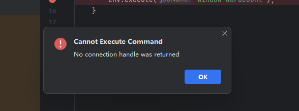
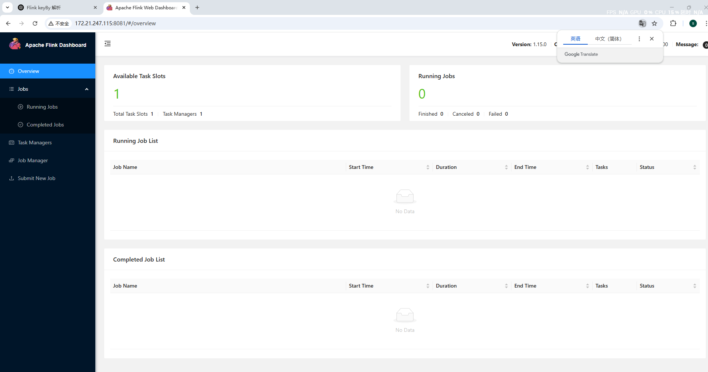
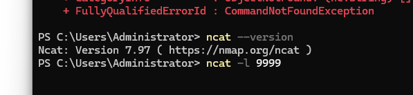
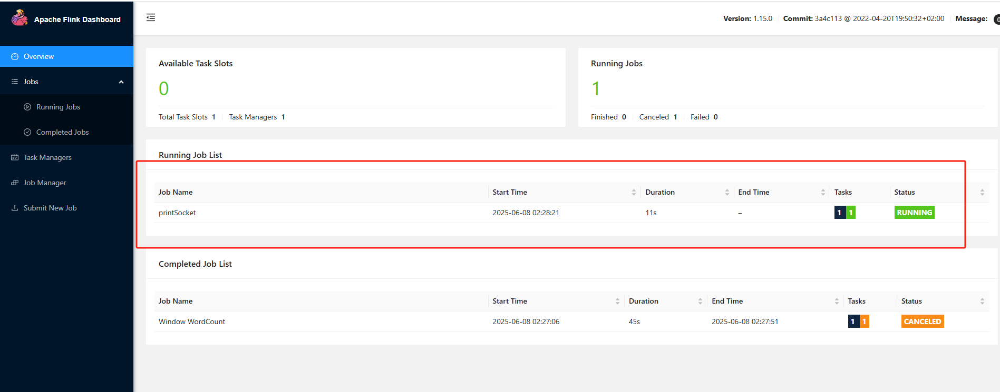
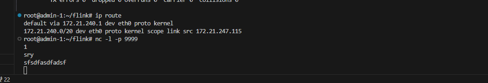
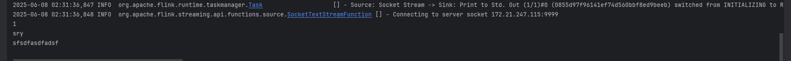
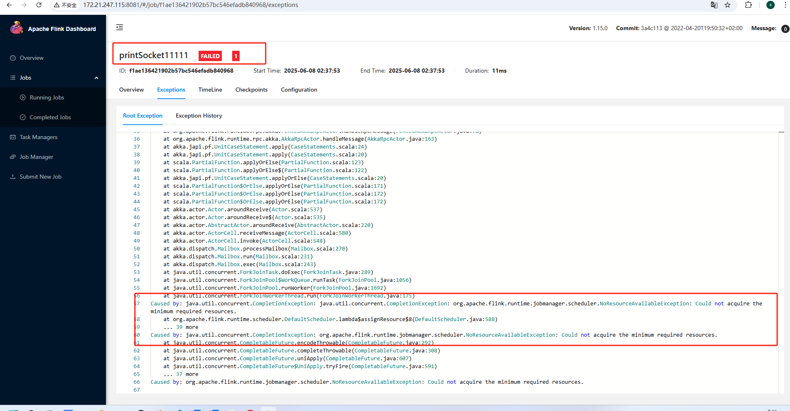

# `flink`作业提交的困惑

## `wsl`启动`JobManager`和`TaskManager`

1. 终于讲到第二章的内容。第3章~第6章都是关于`flink`的算子的实现和使用源码。而从本章开始，会真正开始分析一下`flink`的runtime的源码。

2. 通过`idea`连接`wsl`的`flink`项目，并启动`JobManager`和`TaskManager`。如果有问题。按3进行操作。

   

3. 在使用 VSCode 连接 WSL 时，进入用户的家目录，路径通常是 `/root/.cache/JetBrains`。接着执行如下命令：`mv RemoteDev/ RemoteDevBak/`

   然后重新连接并让系统重新下载配置。连接成功后，再删除 `RemoteDevBak/` 目录即可。

   至于为什么不直接 `rm -rf`，这是一个良好的操作习惯。在生产环境中，**绝不能轻易执行 `rm -rf` 删除操作**，因为一旦误删，后果难以挽回。很多正式环境都会限制或禁用 `rm -rf`，改为通过“移动到指定清理目录 + 定时清理脚本”的方式来安全删除，给系统操作留有挽回的空间。

4. 启动完成后，`url`输入 `wsl`的`ip`地址+`8081`端口号。`wsl`默认是按`NAT`方式上网。`wsl`执行`ipconfig`获取`ip`地址，就可以了。

   

## 本地客户端提交作业到集群

1. 编写以下客户端作业代码
   1. 启动远程服务器时，`ip` 地址应填写你的 WSL 所在机器的真实 IP 地址，而不是本地回环地址 `127.0.0.1`。比如，`env.socketTextStream("172.21.240.1", 9999).print();` 中的 `172.21.240.1` 就是 WSL 的局域网 IP。
   2. 这是因为，原先本地测试时可以用 `127.0.0.1`，但在集群或多机环境中，需要指定真实的网络地址，以保证外部节点能够连接。
   3. 同时，你需要在对应机器上用 `nc -l -p 9999` 启动监听指定端口的服务端，才能让 Flink 通过网络读取数据流。
   4. 如果你对网络基础不熟悉，建议后续学习路由（route）、网络地址转换（NAT）、IP 地址和端口、TCP 协议等知识，这对理解集群通信非常有帮助。

2. 该作业会连接到端口 `9999` 上的客户端，并打印接收到的数据。打印的内容通常以换行符分隔。关于这部分内容，之前在 `socketStream` 相关分析中已经讲过。

~~~java
package org.example;


import org.apache.flink.api.java.tuple.Tuple2;
import org.apache.flink.streaming.api.datastream.DataStream;
import org.apache.flink.streaming.api.environment.StreamExecutionEnvironment;


public class Main {
    public static void main(String[] args) throws Exception {
        StreamExecutionEnvironment env = StreamExecutionEnvironment.createRemoteEnvironment("172.21.247.115", 8081);

        env.socketTextStream("172.21.240.1", 9999).print();

        env.execute("printSocket");
    }

}
~~~

1. `vscode` 上使用 `ifconfig` 和 `ip route` 说明

   1. `eth0` 表示当前机器的第一个网络接口（网卡0），
       `inet` 后面跟的是该网卡的 IPv4 地址，即该网卡绑定的 IP。
   2. `ip route` 命令显示路由表，
       其中 `default via 172.21.240.1` 表示默认路由的下一跳是 `172.21.240.1`，
       也就是说，这个地址是网关（路由器），负责转发数据包。
       在 `NAT` 模式下，这个网关通常就是当前主机本身。
   3. 你也可以用 `wsl`上的`ip`地址，不用 `windows`主机的IP地址。因为 `Ubuntu` 有现成的 `nc -l -p 9999`命令

   ~~~shell
   root@admin-1:~/flink# ifconfig
   eth0: flags=4163<UP,BROADCAST,RUNNING,MULTICAST>  mtu 1500
           inet 172.21.247.115  netmask 255.255.240.0  broadcast 172.21.255.255
           inet6 fe80::215:5dff:fe31:3246  prefixlen 64  scopeid 0x20<link>
           ether 00:15:5d:31:32:46  txqueuelen 1000  (Ethernet)
           RX packets 1330  bytes 780321 (780.3 KB)
           RX errors 0  dropped 0  overruns 0  frame 0
           TX packets 1006  bytes 240370 (240.3 KB)
           TX errors 0  dropped 0 overruns 0  carrier 0  collisions 0
   
   lo: flags=73<UP,LOOPBACK,RUNNING>  mtu 65536
           inet 127.0.0.1  netmask 255.0.0.0
           inet6 ::1  prefixlen 128  scopeid 0x10<host>
           loop  txqueuelen 1000  (Local Loopback)
           RX packets 7789  bytes 18340956 (18.3 MB)
           RX errors 0  dropped 0  overruns 0  frame 0
           TX packets 7789  bytes 18340956 (18.3 MB)
           TX errors 0  dropped 0 overruns 0  carrier 0  collisions 0
           
   root@admin-1:~/flink# ip route
   default via 172.21.240.1 dev eth0 proto kernel 
   172.21.240.0/20 dev eth0 proto kernel scope link src 172.21.247.115
   ~~~

2. 本地 `powershell` 启动 `ncat -l 9999`。效果如下

   

3. 启动本地客户端。可以看到`web`页面有了对应的任务名称

   

4. 在`tcp`服务器上随便输点内容：

   

   

5. 如果你也能达到这个效果，恭喜你。接下来可以步入 `runtime` 的学习了。

## 本地客户端提交的错误作业

1. 接下来，做个有趣的实验。我在原来作业的基础上，加一个简单的`map`操作。该操作用`lambda`表达式描述。

   ~~~java
   package org.example;
   
   
   import org.apache.flink.api.java.tuple.Tuple2;
   import org.apache.flink.streaming.api.datastream.DataStream;
   import org.apache.flink.streaming.api.environment.StreamExecutionEnvironment;
   
   
   public class Main {
       public static void main(String[] args) throws Exception {
           StreamExecutionEnvironment env = StreamExecutionEnvironment.createRemoteEnvironment("172.21.247.115", 8081);
   
           env.socketTextStream("172.21.247.115", 9999).map(x -> x).print();
   
           env.execute("printSocket11111");
       }
   
   }
   ~~~

2. 你会发现客户端直接报错，一堆的`exception`。同时，集群上也有了对应的`exception`。大概内容是：

   ~~~java
   Exception in thread "main" org.apache.flink.client.program.ProgramInvocationException: Job failed (JobID: ed1a54b646bd546857b7096b784b8839)
   	at org.apache.flink.client.deployment.ClusterClientJobClientAdapter.lambda$null$6(ClusterClientJobClientAdapter.java:130)
   	at java.util.concurrent.CompletableFuture.uniApply(CompletableFuture.java:616)
   	at java.util.concurrent.CompletableFuture$UniApply.tryFire(CompletableFuture.java:591)
   	at java.util.concurrent.CompletableFuture.postComplete(CompletableFuture.java:488)
   	at java.util.concurrent.CompletableFuture.complete(CompletableFuture.java:1975)
   	at org.apache.flink.util.concurrent.FutureUtils.lambda$retryOperationWithDelay$9(FutureUtils.java:403)
   	at java.util.concurrent.CompletableFuture.uniWhenComplete(CompletableFuture.java:774)
   	at java.util.concurrent.CompletableFuture$UniWhenComplete.tryFire(CompletableFuture.java:750)
   	at java.util.concurrent.CompletableFuture.postComplete(CompletableFuture.java:488)
   	at java.util.concurrent.CompletableFuture.complete(CompletableFuture.java:1975)
   	at org.apache.flink.client.program.rest.RestClusterClient.lambda$pollResourceAsync$26(RestClusterClient.java:708)
   	at java.util.concurrent.CompletableFuture.uniWhenComplete(CompletableFuture.java:774)
   	at java.util.concurrent.CompletableFuture$UniWhenComplete.tryFire(CompletableFuture.java:750)
   	at java.util.concurrent.CompletableFuture.postComplete(CompletableFuture.java:488)
   	at java.util.concurrent.CompletableFuture.complete(CompletableFuture.java:1975)
   	at org.apache.flink.util.concurrent.FutureUtils.lambda$retryOperationWithDelay$9(FutureUtils.java:403)
   	at java.util.concurrent.CompletableFuture.uniWhenComplete(CompletableFuture.java:774)
   	at java.util.concurrent.CompletableFuture$UniWhenComplete.tryFire(CompletableFuture.java:750)
   	at java.util.concurrent.CompletableFuture.postComplete(CompletableFuture.java:488)
   	at java.util.concurrent.CompletableFuture.postFire(CompletableFuture.java:575)
   	at java.util.concurrent.CompletableFuture$UniCompose.tryFire(CompletableFuture.java:943)
   	at java.util.concurrent.CompletableFuture$Completion.run(CompletableFuture.java:456)
   	at java.util.concurrent.ThreadPoolExecutor.runWorker(ThreadPoolExecutor.java:1149)
   	at java.util.concurrent.ThreadPoolExecutor$Worker.run(ThreadPoolExecutor.java:624)
   	at java.lang.Thread.run(Thread.java:750)
   Caused by: org.apache.flink.runtime.client.JobExecutionException: Job execution failed.
   	at org.apache.flink.runtime.jobmaster.JobResult.toJobExecutionResult(JobResult.java:144)
   	at org.apache.flink.client.deployment.ClusterClientJobClientAdapter.lambda$null$6(ClusterClientJobClientAdapter.java:128)
   	... 24 more
   Caused by: org.apache.flink.runtime.JobException: Recovery is suppressed by NoRestartBackoffTimeStrategy
   	at org.apache.flink.runtime.executiongraph.failover.flip1.ExecutionFailureHandler.handleFailure(ExecutionFailureHandler.java:138)
   	at org.apache.flink.runtime.executiongraph.failover.flip1.ExecutionFailureHandler.getFailureHandlingResult(ExecutionFailureHandler.java:82)
   	at org.apache.flink.runtime.scheduler.DefaultScheduler.handleTaskFailure(DefaultScheduler.java:301)
   	at org.apache.flink.runtime.scheduler.DefaultScheduler.maybeHandleTaskFailure(DefaultScheduler.java:291)
   	at org.apache.flink.runtime.scheduler.DefaultScheduler.updateTaskExecutionStateInternal(DefaultScheduler.java:282)
   	at org.apache.flink.runtime.scheduler.SchedulerBase.updateTaskExecutionState(SchedulerBase.java:739)
   	at org.apache.flink.runtime.scheduler.SchedulerNG.updateTaskExecutionState(SchedulerNG.java:78)
   	at org.apache.flink.runtime.jobmaster.JobMaster.updateTaskExecutionState(JobMaster.java:443)
   	at sun.reflect.NativeMethodAccessorImpl.invoke0(Native Method)
   	at sun.reflect.NativeMethodAccessorImpl.invoke(NativeMethodAccessorImpl.java:62)
   	at sun.reflect.DelegatingMethodAccessorImpl.invoke(DelegatingMethodAccessorImpl.java:43)
   	at java.lang.reflect.Method.invoke(Method.java:498)
   	at org.apache.flink.runtime.rpc.akka.AkkaRpcActor.lambda$handleRpcInvocation$1(AkkaRpcActor.java:304)
   	at org.apache.flink.runtime.concurrent.akka.ClassLoadingUtils.runWithContextClassLoader(ClassLoadingUtils.java:83)
   	at org.apache.flink.runtime.rpc.akka.AkkaRpcActor.handleRpcInvocation(AkkaRpcActor.java:302)
   	at org.apache.flink.runtime.rpc.akka.AkkaRpcActor.handleRpcMessage(AkkaRpcActor.java:217)
   	at org.apache.flink.runtime.rpc.akka.FencedAkkaRpcActor.handleRpcMessage(FencedAkkaRpcActor.java:78)
   	at org.apache.flink.runtime.rpc.akka.AkkaRpcActor.handleMessage(AkkaRpcActor.java:163)
   	at akka.japi.pf.UnitCaseStatement.apply(CaseStatements.scala:24)
   	at akka.japi.pf.UnitCaseStatement.apply(CaseStatements.scala:20)
   	at scala.PartialFunction.applyOrElse(PartialFunction.scala:123)
   	at scala.PartialFunction.applyOrElse$(PartialFunction.scala:122)
   	at akka.japi.pf.UnitCaseStatement.applyOrElse(CaseStatements.scala:20)
   	at scala.PartialFunction$OrElse.applyOrElse(PartialFunction.scala:171)
   	at scala.PartialFunction$OrElse.applyOrElse(PartialFunction.scala:172)
   	at scala.PartialFunction$OrElse.applyOrElse(PartialFunction.scala:172)
   	at akka.actor.Actor.aroundReceive(Actor.scala:537)
   	at akka.actor.Actor.aroundReceive$(Actor.scala:535)
   	at akka.actor.AbstractActor.aroundReceive(AbstractActor.scala:220)
   	at akka.actor.ActorCell.receiveMessage(ActorCell.scala:580)
   	at akka.actor.ActorCell.invoke(ActorCell.scala:548)
   	at akka.dispatch.Mailbox.processMailbox(Mailbox.scala:270)
   	at akka.dispatch.Mailbox.run(Mailbox.scala:231)
   	at akka.dispatch.Mailbox.exec(Mailbox.scala:243)
   	at java.util.concurrent.ForkJoinTask.doExec(ForkJoinTask.java:289)
   	at java.util.concurrent.ForkJoinPool$WorkQueue.runTask(ForkJoinPool.java:1056)
   	at java.util.concurrent.ForkJoinPool.runWorker(ForkJoinPool.java:1692)
   	at java.util.concurrent.ForkJoinWorkerThread.run(ForkJoinWorkerThread.java:175)
   Caused by: org.apache.flink.streaming.runtime.tasks.StreamTaskException: Cannot instantiate user function.
   	at org.apache.flink.streaming.api.graph.StreamConfig.getStreamOperatorFactory(StreamConfig.java:340)
   	at org.apache.flink.streaming.runtime.tasks.OperatorChain.createOperator(OperatorChain.java:744)
   	at org.apache.flink.streaming.runtime.tasks.OperatorChain.createOperatorChain(OperatorChain.java:717)
   	at org.apache.flink.streaming.runtime.tasks.OperatorChain.createOutputCollector(OperatorChain.java:657)
   	at org.apache.flink.streaming.runtime.tasks.OperatorChain.<init>(OperatorChain.java:190)
   	at org.apache.flink.streaming.runtime.tasks.RegularOperatorChain.<init>(RegularOperatorChain.java:60)
   	at org.apache.flink.streaming.runtime.tasks.StreamTask.restoreInternal(StreamTask.java:655)
   	at org.apache.flink.streaming.runtime.tasks.StreamTask.restore(StreamTask.java:643)
   	at org.apache.flink.runtime.taskmanager.Task.runWithSystemExitMonitoring(Task.java:948)
   	at org.apache.flink.runtime.taskmanager.Task.restoreAndInvoke(Task.java:917)
   	at org.apache.flink.runtime.taskmanager.Task.doRun(Task.java:741)
   	at org.apache.flink.runtime.taskmanager.Task.run(Task.java:563)
   	at java.lang.Thread.run(Thread.java:750)
   Caused by: java.lang.ClassCastException: cannot assign instance of java.lang.invoke.SerializedLambda to field org.apache.flink.streaming.api.operators.AbstractUdfStreamOperator.userFunction of type org.apache.flink.api.common.functions.Function in instance of org.apache.flink.streaming.api.operators.StreamMap
   	at java.io.ObjectStreamClass$FieldReflector.setObjFieldValues(ObjectStreamClass.java:2301)
   	at java.io.ObjectStreamClass.setObjFieldValues(ObjectStreamClass.java:1431)
   	at java.io.ObjectInputStream.defaultReadFields(ObjectInputStream.java:2437)
   	at java.io.ObjectInputStream.readSerialData(ObjectInputStream.java:2355)
   	at java.io.ObjectInputStream.readOrdinaryObject(ObjectInputStream.java:2213)
   	at java.io.ObjectInputStream.readObject0(ObjectInputStream.java:1669)
   	at java.io.ObjectInputStream.defaultReadFields(ObjectInputStream.java:2431)
   	at java.io.ObjectInputStream.readSerialData(ObjectInputStream.java:2355)
   	at java.io.ObjectInputStream.readOrdinaryObject(ObjectInputStream.java:2213)
   	at java.io.ObjectInputStream.readObject0(ObjectInputStream.java:1669)
   	at java.io.ObjectInputStream.readObject(ObjectInputStream.java:503)
   	at java.io.ObjectInputStream.readObject(ObjectInputStream.java:461)
   	at org.apache.flink.util.InstantiationUtil.deserializeObject(InstantiationUtil.java:617)
   	at org.apache.flink.util.InstantiationUtil.deserializeObject(InstantiationUtil.java:602)
   	at org.apache.flink.util.InstantiationUtil.deserializeObject(InstantiationUtil.java:589)
   	at org.apache.flink.util.InstantiationUtil.readObjectFromConfig(InstantiationUtil.java:543)
   	at org.apache.flink.streaming.api.graph.StreamConfig.getStreamOperatorFactory(StreamConfig.java:324)
   	... 12 more
   ~~~

3. 报错核心信息如下：

   > ```
   > Caused by: java.lang.ClassCastException: cannot assign instance of java.lang.invoke.SerializedLambda to field org.apache.flink.streaming.api.operators.AbstractUdfStreamOperator.userFunction of type org.apache.flink.api.common.functions.Function in instance of org.apache.flink.streaming.api.operators.StreamMap
   > ```

   这个异常本质上是因为对象序列化失败所导致的。具体来说，是由于使用了 `Lambda` 表达式，`Flink` 会将该 `Lambda` 编译成一个匿名类，而这个类并未被打包上传至集群运行环境中，导致反序列化时出现 `ClassCastException`。

   在日常开发中，这类问题非常常见，尤其是在函数式编程大量使用的场景下。例如：序列化失败、类转换错误（如 `ClassCastException`）等，往往都是因为类在集群端不可识别，或者类加载器找不到对应定义。

   在接下来的源码分析过程中，我们也将深入理解这类问题的根源，以及` Flink `是如何设计用户函数序列化与反序列化机制的，从而更稳健地进行分布式计算开发。

   

   
