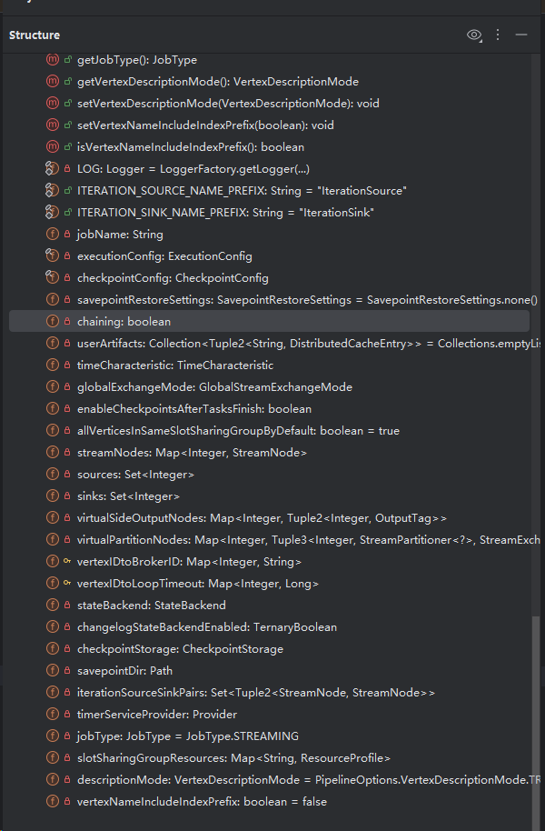

# `flink`作业提交流程

## 构造`streamGraph`

1. `flink` 执行`execute`方法的本质是通过`StreamExecutionEnvironment`.`transformations`变量构造`StreamGraph`变量。

   ~~~java
    public JobExecutionResult execute(String jobName) throws Exception {
           Preconditions.checkNotNull(jobName, "Streaming Job name should not be null.");
           final StreamGraph streamGraph = getStreamGraph();
           streamGraph.setJobName(jobName);
           return execute(streamGraph);
       }
       
    public StreamGraph getStreamGraph(boolean clearTransformations) {
           //调用 getStreamGraphGenerator 方法产生作业的 dag图，也就是 StreamGraph
           final StreamGraph streamGraph = getStreamGraphGenerator(transformations).generate();
           if (clearTransformations) {
               transformations.clear();
           }
           return streamGraph;
       }
   ~~~

2. 首先看一下 `getStreamGraphGenerator`方法。

   ~~~java
   private StreamGraphGenerator getStreamGraphGenerator(List<Transformation<?>> transformations) {
           if (transformations.size() <= 0) {
               throw new IllegalStateException(
                       "No operators defined in streaming topology. Cannot execute.");
           }
   
           // We copy the transformation so that newly added transformations cannot intervene with the
           // stream graph generation.
           return new StreamGraphGenerator(
                           new ArrayList<>(transformations), config, checkpointCfg, configuration)
                   .setStateBackend(defaultStateBackend)
                   .setChangelogStateBackendEnabled(changelogStateBackendEnabled)
                   .setSavepointDir(defaultSavepointDirectory)
                   .setChaining(isChainingEnabled)
                   .setUserArtifacts(cacheFile)
                   .setTimeCharacteristic(timeCharacteristic)
                   .setDefaultBufferTimeout(bufferTimeout)
                   .setSlotSharingGroupResource(slotSharingGroupResources);
       }
   ~~~

3. 该方法将各种`env`配置和`transformations`重新分配给了 `StreamGraphGenerator` 对象。通过 `StreamGraphGenerator.generate` 方法产生一个 `streamGraph`。`generate`方法比较复杂，只需要中文注释的几个步骤。

   ~~~java
   public StreamGraph generate() {
           streamGraph = new StreamGraph(executionConfig, checkpointConfig, savepointRestoreSettings);
           streamGraph.setEnableCheckpointsAfterTasksFinish(
                   configuration.get(
                           ExecutionCheckpointingOptions.ENABLE_CHECKPOINTS_AFTER_TASKS_FINISH));
           shouldExecuteInBatchMode = shouldExecuteInBatchMode();
           configureStreamGraph(streamGraph);
   		
       	//该变量是一个引用hashMap。通过引用判断该对象是否存在。防止transformations里的transformation被重复使用
           alreadyTransformed = new IdentityHashMap<>();
   
           for (Transformation<?> transformation : transformations) {
               //这里是将transform转换为StreamGraph的streamNodes
               transform(transformation);
           }
   
           streamGraph.setSlotSharingGroupResource(slotSharingGroupResources);
   
           setFineGrainedGlobalStreamExchangeMode(streamGraph);
   
           for (StreamNode node : streamGraph.getStreamNodes()) {
               if (node.getInEdges().stream().anyMatch(this::shouldDisableUnalignedCheckpointing)) {
                   for (StreamEdge edge : node.getInEdges()) {
                       edge.setSupportsUnalignedCheckpoints(false);
                   }
               }
           }
   
           final StreamGraph builtStreamGraph = streamGraph;
   
           alreadyTransformed.clear();
           alreadyTransformed = null;
           streamGraph = null;
   		
       	//最后返回该对象
           return builtStreamGraph;
       }
   ~~~

4. 接下来看一下 `transform`方法

   ~~~java
   private Collection<Integer> transform(Transformation<?> transform) {
   		//第一步就是判断是否处理过 该transform
           if (alreadyTransformed.containsKey(transform)) {
               return alreadyTransformed.get(transform);
           }
   
           LOG.debug("Transforming " + transform);
   
           if (transform.getMaxParallelism() <= 0) {
   
               // if the max parallelism hasn't been set, then first use the job wide max parallelism
               // from the ExecutionConfig.
               int globalMaxParallelismFromConfig = executionConfig.getMaxParallelism();
               if (globalMaxParallelismFromConfig > 0) {
                   transform.setMaxParallelism(globalMaxParallelismFromConfig);
               }
           }
   
           transform
                   .getSlotSharingGroup()
                   .ifPresent(
                           slotSharingGroup -> {
                               final ResourceSpec resourceSpec =
                                       SlotSharingGroupUtils.extractResourceSpec(slotSharingGroup);
                               if (!resourceSpec.equals(ResourceSpec.UNKNOWN)) {
                                   slotSharingGroupResources.compute(
                                           slotSharingGroup.getName(),
                                           (name, profile) -> {
                                               if (profile == null) {
                                                   return ResourceProfile.fromResourceSpec(
                                                           resourceSpec, MemorySize.ZERO);
                                               } else if (!ResourceProfile.fromResourceSpec(
                                                               resourceSpec, MemorySize.ZERO)
                                                       .equals(profile)) {
                                                   throw new IllegalArgumentException(
                                                           "The slot sharing group "
                                                                   + slotSharingGroup.getName()
                                                                   + " has been configured with two different resource spec.");
                                               } else {
                                                   return profile;
                                               }
                                           });
                               }
                           });
   
           // call at least once to trigger exceptions about MissingTypeInfo
           transform.getOutputType();
   
       	//这一步获取transform的转换器。通过translatorMap.get(transform.getClass());方法。该方法贴在下方文稿
           @SuppressWarnings("unchecked")
           final TransformationTranslator<?, Transformation<?>> translator =
                   (TransformationTranslator<?, Transformation<?>>)
                           translatorMap.get(transform.getClass());
   
           Collection<Integer> transformedIds;
           if (translator != null) {
               //这一步开始转换
               transformedIds = translate(translator, transform);
           } else {
               //历史的流转换。
               transformedIds = legacyTransform(transform);
           }
   
           // need this check because the iterate transformation adds itself before
           // transforming the feedback edges
           if (!alreadyTransformed.containsKey(transform)) {
               alreadyTransformed.put(transform, transformedIds);
           }
   
           return transformedIds;
       }
   ~~~

5. `StreamGraphGenerator`的`translatorMap`保存了各种`transformation`的转换器。通过`static`方法声明。

   ~~~java
   @SuppressWarnings("rawtypes")
       private static final Map<
                       Class<? extends Transformation>,
                       TransformationTranslator<?, ? extends Transformation>>
               translatorMap;
   
       static {
           @SuppressWarnings("rawtypes")
           Map<Class<? extends Transformation>, TransformationTranslator<?, ? extends Transformation>>
                   tmp = new HashMap<>();
           tmp.put(OneInputTransformation.class, new OneInputTransformationTranslator<>());
           tmp.put(TwoInputTransformation.class, new TwoInputTransformationTranslator<>());
           tmp.put(MultipleInputTransformation.class, new MultiInputTransformationTranslator<>());
           tmp.put(KeyedMultipleInputTransformation.class, new MultiInputTransformationTranslator<>());
           tmp.put(SourceTransformation.class, new SourceTransformationTranslator<>());
           tmp.put(SinkTransformation.class, new SinkTransformationTranslator<>());
           tmp.put(LegacySinkTransformation.class, new LegacySinkTransformationTranslator<>());
           tmp.put(LegacySourceTransformation.class, new LegacySourceTransformationTranslator<>());
           tmp.put(UnionTransformation.class, new UnionTransformationTranslator<>());
           tmp.put(PartitionTransformation.class, new PartitionTransformationTranslator<>());
           tmp.put(SideOutputTransformation.class, new SideOutputTransformationTranslator<>());
           tmp.put(ReduceTransformation.class, new ReduceTransformationTranslator<>());
           tmp.put(
                   TimestampsAndWatermarksTransformation.class,
                   new TimestampsAndWatermarksTransformationTranslator<>());
           tmp.put(BroadcastStateTransformation.class, new BroadcastStateTransformationTranslator<>());
           tmp.put(
                   KeyedBroadcastStateTransformation.class,
                   new KeyedBroadcastStateTransformationTranslator<>());
           translatorMap = Collections.unmodifiableMap(tmp);
       }
   ~~~

6. 看一下 `translate`方法

   ~~~java
   private Collection<Integer> translate(
               final TransformationTranslator<?, Transformation<?>> translator,
               final Transformation<?> transform) {
           checkNotNull(translator);
           checkNotNull(transform);
   
           final List<Collection<Integer>> allInputIds = getParentInputIds(transform.getInputs());
   
           // the recursive call might have already transformed this
           if (alreadyTransformed.containsKey(transform)) {
               return alreadyTransformed.get(transform);
           }
   
           final String slotSharingGroup =
                   determineSlotSharingGroup(
                           transform.getSlotSharingGroup().isPresent()
                                   ? transform.getSlotSharingGroup().get().getName()
                                   : null,
                           allInputIds.stream()
                                   .flatMap(Collection::stream)
                                   .collect(Collectors.toList()));
   
           final TransformationTranslator.Context context =
                   new ContextImpl(this, streamGraph, slotSharingGroup, configuration);
   		
       	//这一步是做真正的转换
           return shouldExecuteInBatchMode
                   ? translator.translateForBatch(transform, context)
               	 //translator是抽象类，对应的实现是各种transformation。感兴趣的可以看下是如何实现的。里面通常都能看到关键代码
                   // streamGraph.addEdge(inputId, transformationId, 0);
                   : translator.translateForStreaming(transform, context);
       }
   ~~~

7. 最后再看一下`StreamGraph`对象。毕竟后面都是围绕`StreamGraph`对象。`streamNodes`就是dag拓扑图的数据结构。

   

   8. 构造完成 `StreamGraph` 后，接下来就是调用 `return execute(streamGraph);` 来提交作业。这个步骤的核心，是获取一个 `PipelineExecutorFactory` 对象。该对象负责根据当前运行环境，提供不同的执行模式。

      在实际运行中，如果是提交到集群，获取的通常是 `RemoteExecutor`；如果是本地运行，则是 `LocalExecutor`。无论哪种模式，这个执行器都会将 `StreamGraph` 序列化写入本地临时目录，同时准备好相关的配置项与依赖 JAR 包，然后统一发送到远端服务器进行作业部署和执行。

      这也正是为什么我们在第 7 章直接执行 `main` 方法中的 `lambda` 表达式时会遇到序列化报错的根本原因：虽然 `StreamGraph` 被写入并传给了服务器，但由于 lambda 表达式对应的匿名类并没有被打包进 JAR 包中一起上传，远端服务器在反序列化 `StreamGraph` 时无法加载该类，从而导致了 `ClassCastException` 等错误。

      ~~~java
      @Override
          public CompletableFuture<JobID> submitJob(@Nonnull JobGraph jobGraph) {
              CompletableFuture<java.nio.file.Path> jobGraphFileFuture =
                      CompletableFuture.supplyAsync(
                              () -> {
                                  try {
                                      //这一步将 JobGraph 写入本地
                                      final java.nio.file.Path jobGraphFile =
                                              Files.createTempFile("flink-jobgraph", ".bin");
                                      try (ObjectOutputStream objectOut =
                                              new ObjectOutputStream(
                                                      Files.newOutputStream(jobGraphFile))) {
                                          objectOut.writeObject(jobGraph);
                                      }
                                      return jobGraphFile;
                                  } catch (IOException e) {
                                      throw new CompletionException(
                                              new FlinkException("Failed to serialize JobGraph.", e));
                                  }
                              },
                              executorService);
      
              CompletableFuture<Tuple2<JobSubmitRequestBody, Collection<FileUpload>>> requestFuture =
                      jobGraphFileFuture.thenApply(
                  			//这一步获取对应的jar包路径并上传。同时构造body。细节感兴趣自己去看。
                              jobGraphFile -> {
                                  List<String> jarFileNames = new ArrayList<>(8);
                                  List<JobSubmitRequestBody.DistributedCacheFile> artifactFileNames =
                                          new ArrayList<>(8);
                                  Collection<FileUpload> filesToUpload = new ArrayList<>(8);
      
                                  filesToUpload.add(
                                          new FileUpload(
                                                  jobGraphFile, RestConstants.CONTENT_TYPE_BINARY));
      
                                  for (Path jar : jobGraph.getUserJars()) {
                                      jarFileNames.add(jar.getName());
                                      filesToUpload.add(
                                              new FileUpload(
                                                      Paths.get(jar.toUri()),
                                                      RestConstants.CONTENT_TYPE_JAR));
                                  }
      
                                  for (Map.Entry<String, DistributedCache.DistributedCacheEntry>
                                          artifacts : jobGraph.getUserArtifacts().entrySet()) {
                                      final Path artifactFilePath =
                                              new Path(artifacts.getValue().filePath);
                                      try {
                                          // Only local artifacts need to be uploaded.
                                          if (!artifactFilePath.getFileSystem().isDistributedFS()) {
                                              artifactFileNames.add(
                                                      new JobSubmitRequestBody.DistributedCacheFile(
                                                              artifacts.getKey(),
                                                              artifactFilePath.getName()));
                                              filesToUpload.add(
                                                      new FileUpload(
                                                              Paths.get(artifactFilePath.getPath()),
                                                              RestConstants.CONTENT_TYPE_BINARY));
                                          }
                                      } catch (IOException e) {
                                          throw new CompletionException(
                                                  new FlinkException(
                                                          "Failed to get the FileSystem of artifact "
                                                                  + artifactFilePath
                                                                  + ".",
                                                          e));
                                      }
                                  }
      
                                  final JobSubmitRequestBody requestBody =
                                          new JobSubmitRequestBody(
                                                  jobGraphFile.getFileName().toString(),
                                                  jarFileNames,
                                                  artifactFileNames);
      
                                  return Tuple2.of(
                                          requestBody, Collections.unmodifiableCollection(filesToUpload));
                              });
      
              final CompletableFuture<JobSubmitResponseBody> submissionFuture =
                      requestFuture.thenCompose(
                              requestAndFileUploads -> {
                                  LOG.info(
                                          "Submitting job '{}' ({}).",
                                          jobGraph.getName(),
                                          jobGraph.getJobID());
                                  return sendRetriableRequest(
                                          JobSubmitHeaders.getInstance(),
                                          EmptyMessageParameters.getInstance(),
                                          requestAndFileUploads.f0,
                                          requestAndFileUploads.f1,
                                          isConnectionProblemOrServiceUnavailable(),
                                          (receiver, error) -> {
                                              if (error != null) {
                                                  LOG.warn(
                                                          "Attempt to submit job '{}' ({}) to '{}' has failed.",
                                                          jobGraph.getName(),
                                                          jobGraph.getJobID(),
                                                          receiver,
                                                          error);
                                              } else {
                                                  LOG.info(
                                                          "Successfully submitted job '{}' ({}) to '{}'.",
                                                          jobGraph.getName(),
                                                          jobGraph.getJobID(),
                                                          receiver);
                                              }
                                          });
                              });
      
              submissionFuture
                      .thenCompose(ignored -> jobGraphFileFuture)
                      .thenAccept(
                              jobGraphFile -> {
                                  try {
                                      Files.delete(jobGraphFile);
                                  } catch (IOException e) {
                                      LOG.warn("Could not delete temporary file {}.", jobGraphFile, e);
                                  }
                              });
      
              return submissionFuture
                      .thenApply(ignore -> jobGraph.getJobID())
                      .exceptionally(
                              (Throwable throwable) -> {
                                  throw new CompletionException(
                                          new JobSubmissionException(
                                                  jobGraph.getJobID(),
                                                  "Failed to submit JobGraph.",
                                                  ExceptionUtils.stripCompletionException(throwable)));
                              });
          }
      ~~~

   9. 所以，**为什么 Flink 官网推荐我们使用 Maven 的特定打包插件（如 `flink-shaded`, `maven-shade-plugin` 等）来构建作业 Jar 包？**原因就在于：Flink 的远程执行模式中，**程序的主体逻辑和依赖并不会随着代码同步传输到集群**，而是通过 Jar 包上传。因此，**所有需要在集群端使用的类和依赖，都必须提前打包进 Jar 中**，否则就会出现类找不到、反序列化失败等问题。

      1. 本地开发 vs 远程部署
         - 平时开发阶段，如果条件允许，可以使用本地运行模式进行快速验证。但在实际场景中，代码往往涉及**检查点、Kerberos 验证、HDFS 读写等复杂配置**，这些功能依赖于测试环境与本地环境之间的网络打通和权限设置，配置起来非常繁琐。
         - 因此，**更实际的做法是：本地只负责编写和调试核心逻辑，然后打包上传至集群，通过 `print()` 等方式验证运行结果是否符合预期**。这种方式也更贴近生产部署流程。
      2. 关于打包依赖的处理方式
         - 打包部署时，**需要使用特定工具（如 Maven Shade 插件）将所有用到的依赖打进 Fat Jar**，确保作业在集群中能正常运行。
         - 如果 `Flink` 集群需要连接多个版本的 `Kafka` 客户端、`MySQL` 驱动等，不建议将所有这些依赖统一放入 `Flink` 集群的 `plugins/` 目录下。这样做虽然方便管理，但容易引起版本冲突。
         - 更好的方式是**每个作业根据实际需要单独打包所需依赖**，即使会导致 `Jar` 包体积较大，构建时间较长，但**能有效避免环境耦合和依赖污染**。
         - 最终，在生产中仍建议对接统一版本的 `Kafka/MySQL` 等组件，从而**在打包和依赖管理上实现稳定和简化**。
